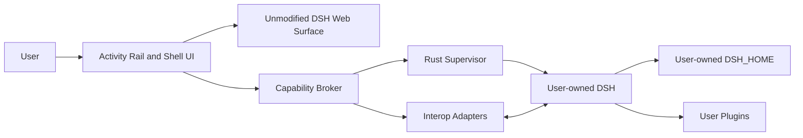

# DSH Desktop Shell

DSH Desktop Shell 是面向用户自有 DeepSeek Harness 的跨平台桌面工作台与本地能力宿主。它不分发、不升级、不修改用户的 DSH Core 或 `DSH_HOME`，而是在外层提供稳定的桌面窗口、进程监督、原生能力、兼容适配与恢复体验。

> 当前阶段：`shell-mvp` / M2 Reliable Runtime in progress（M1 Shell MVP 与 M2 四切片已交付并处于 review）。
>
> Maintainer 已批准 `HANDOFF-M0` 并将 `implementation_authorized` 设为 `true`。M1 Shell MVP（Environment/Discovery/Managed/Attached/DSH Surface，含真实 user-owned DSH WebView2 smoke 26/26）与 M2 Reliable Runtime（restart/recovery/Safe Stop、diagnostics、local-transport、capability broker）均已交付；等待 maintainer 评审。

## 一句话架构

```text
DSH Desktop Shell
  = DSH 专用浏览器
  + Native Capability Host
  + Runtime Supervisor
  + Replaceable Interop Adapters
```



## 核心不变量

- 用户拥有 DSH 安装、Node/pnpm、`DSH_HOME`、Profile、插件、凭据与升级节奏。
- Desktop 只保存引用；不替用户修改 Profile 或安装插件。
- Managed 与 Attached 必须显式区分；连接权不等于进程所有权。
- 上游 DSH Web UI 原样承载，不 fork、不注入 DOM、不暴露 privileged Tauri IPC。
- Capability 独立版本化；`dsh-std` 兼容但不是运行前置依赖。
- P0 使用 Tauri 2 + React/TypeScript + Rust，并在 Tauri 后端内运行 Supervisor；P2 再 daemonize。

## 快速入口

1. [START_HERE.md](START_HERE.md)：15 分钟接手路径。
2. [CHARTER.md](CHARTER.md)：目标、非目标和成功标准。
3. [docs/INDEX.md](docs/INDEX.md)：全量文档索引。
4. [Architecture Overview](docs/architecture/OVERVIEW.md)：概念架构与边界。
5. [Repository Map](docs/code-map/REPOSITORY_MAP.md)：当前实现与后续模块代码地图。
6. [Current Status](tracking/CURRENT.md)：当前状态与下一动作。
7. [AGENTS.md](AGENTS.md)：跨 Agent / Session 执行协议。
8. [Desktop Application](apps/desktop/README.md)：M1 当前实现、边界与本地验证。

## 外部基线

`verified_on: 2026-08-25` · `verified_at: 2026-08-25T12:19:55Z`

- [DeepSeek Harness](https://github.com/deepseek-ai/deepseek-harness/blob/b150a551b8d465e31e418e1b2eaf5e79bbb7d28e/README.md)：Developer Preview；npm `latest` 为 `@deepseek-ai/dsh@0.1.1-rc.2`。
- [dsh-std](https://github.com/Yan-Zero/dsh-std/blob/bb194ad53a72f4fa7da1286c88dcebb488b43eb9/README.md)：代码与提案仍为 early drafts，`latest` 与 `rc` dist-tag 必须分别处理。
- [Tauri 2 Capabilities](https://v2.tauri.app/security/capabilities/)：按 window/webview 授权；多 capability 权限会合并。
- [Apache License 2.0](https://www.apache.org/licenses/LICENSE-2.0)：本项目许可证。

精确 commit、release、registry integrity、许可证附加条款和影响分析见 [External Baseline](docs/research/EXTERNAL_BASELINE.md)。

## 许可证与来源

本项目采用 Apache-2.0。架构研究采用 clean-room 原则：可以研究公开行为、需求和架构模式，但未经专项许可审计不得复制第三方源代码、资产或实质性实现。详见 [Clean-room Policy](docs/compliance/CLEAN_ROOM.md)。
