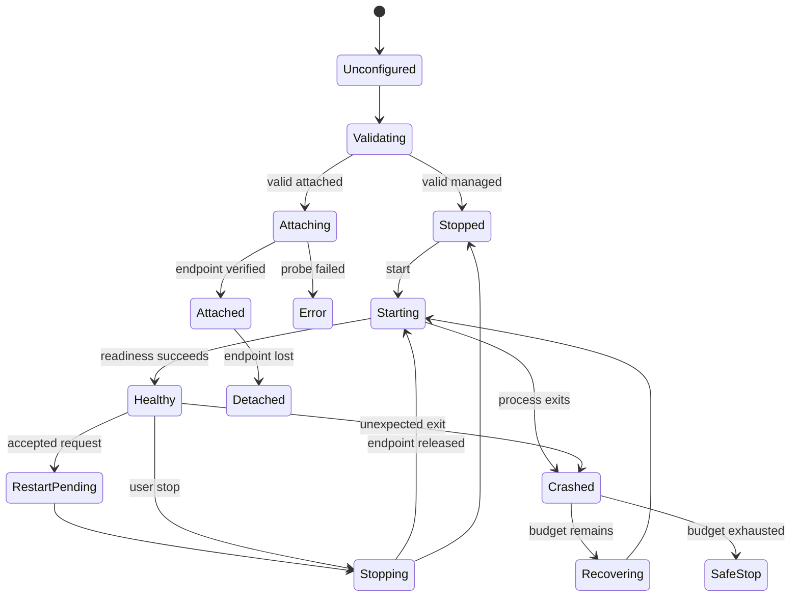

# Lifecycle

## Backend 状态

## 原则

- Attached 不进入 Managed stop/restart branch。
- 每次 Managed start 产生新 generation 和 process identity。
- PID 只是 identity 的一部分，还需 launch token/handle/start time。
- Recovery 使用 bounded retry 和 backoff；初始建议为 60 秒内最多 3 次，M2 PoC 后冻结。
- force terminate 是最后手段；完成后必须验证 process group 与 endpoint。
