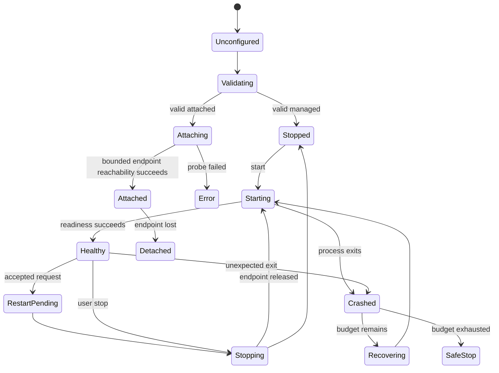

# Lifecycle

## Backend 状态

## 原则

- Attached 不进入 Managed stop/restart branch。
- M1 Attached probe 只证明持久化 loopback endpoint 的 TCP reachability；DSH identity 仍为 unverified，process ownership 始终为 external。
- Attached Environment 使用 `port=auto` 时无法探测，返回结构化 `UNAVAILABLE`，不扫描端口。
- 每次 Managed start 产生新 generation 和 process identity。
- PID 只是 identity 的一部分，还需 launch token/handle/start time。
- Recovery 使用 bounded retry 和 backoff；初始建议为 60 秒内最多 3 次，M2 PoC 后冻结。
- force terminate 是最后手段；完成后必须验证 process group 与 endpoint。

## M1 Managed readiness slice

- `start`、`status`、`stop` 请求只携带 persisted Environment ID；`stop` 额外携带 `expectedGeneration`。调用方不能提供 executable、argv、cwd、host、port、instance ID 或 endpoint。
- 每次成功进入 `Starting` 前递增 generation 并建立新的 opaque instance ID 与 process-tree handle。仅当三者仍是当前值时，后续 output/readiness evidence 才有效。
- 冻结 DSH baseline 在 Loader 完成后输出 `dsh web:` canonical URL。该行仍只是 candidate；必须继续验证 exact loopback root URL、允许的 legacy/authenticated bootstrap shape、配置端口约束、owned child 存活与 bounded TCP connect，随后才进入 `Healthy` 并发布 sanitized endpoint。
- 仅端口可达、foreign process 输出、caller credential、畸形/额外 query、非 HTTP/另一 loopback URL、旧 generation 或超时全部 fail closed。合法 DSH bootstrap credential 只存在于 current Supervisor generation，不进入 report、日志或 tracking。
- M1 stop 先尝试平台可用的 graceful process-group stop，再以 bounded force tree cleanup 收尾并记录 disposition。Restart、crash-loop recovery 与 daemon handover仍属于后续切片。
