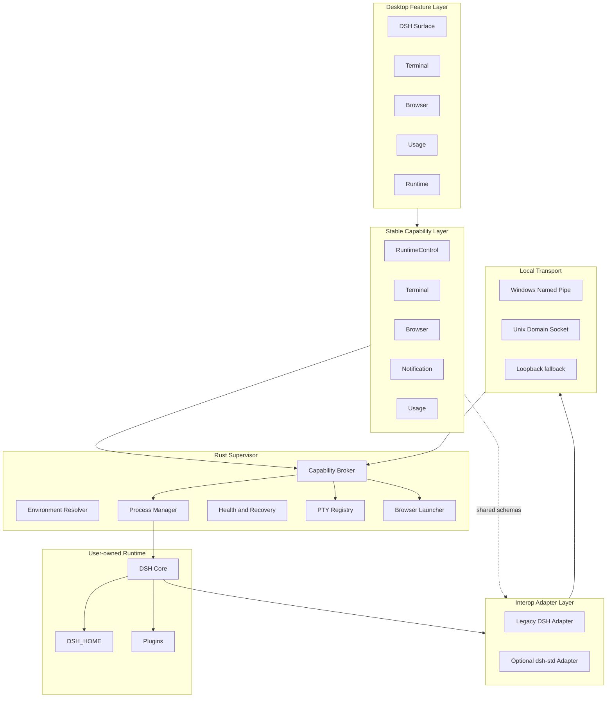

# Architecture Overview

## 四个 Ownership Domain

```text
Shell UI        Desktop owns presentation
Supervisor      Desktop owns native lifecycle
DSH Core        User owns installation and semantics
DSH Data        User owns DSH_HOME, Profile, plugins and credentials
```

## 分层



Legacy 与 optional dsh-std Adapter 执行在 DSH/plugin integration boundary，不在 DSH WebView 内，也不拥有 Desktop native provider。P0 Capability Broker 是 `MOD-SUPERVISOR` 内的受信任子组件，负责 Agreement、Desktop grant、lease、scope、generation 与 provider dispatch；contract validation 本身不构成授权。

## 目标态

P0 在 Tauri Rust 后端集成 Supervisor，缩小初始 daemon/IPC 安装复杂度。P2 将 Supervisor 拆为独立 native daemon，使 Shell UI、Supervisor 和 DSH 三种生命周期彻底隔离。

Shared Browser 通过 shell-neutral Browser Capability 连接 Chromium/Edge/CDP provider；Tauri system WebView 只负责 Surface，不作为统一 automation contract。

## 设计权威

- 不变量：[INVARIANTS.md](INVARIANTS.md)
- 组件：[COMPONENTS.md](COMPONENTS.md)
- 运行拓扑：[RUNTIME_TOPOLOGY.md](RUNTIME_TOPOLOGY.md)
- 决策：[ADR Index](../decisions/README.md)
- 接口：[Specifications](../../specs/README.md)
