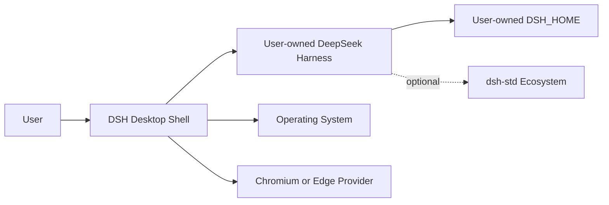

# System Context

## 外部系统

- DSH：Agent、Session、Profile、Plugin、Scheduler 和 Usage 语义权威。
- OS：process、window、notification、PTY、filesystem dialog 与 IPC。
- Browser provider：网页 session、CDP、snapshot、interaction 和 human takeover。
- dsh-std：可选互操作模型；不是启动依赖。
- GitHub：用于项目协作、release 与 provenance；不是 Desktop runtime dependency，也不属于用户数据通路。

## 信任假设

DSH plugin 与 DSH Core 同进程运行，capability declaration 不是 sandbox。携带到 DSH process 的 endpoint/token 只能证明“来自该 DSH 进程”，不能证明“来自特定插件”。高权限操作仍需 DSH-side provenance/policy 和 Desktop grant。
