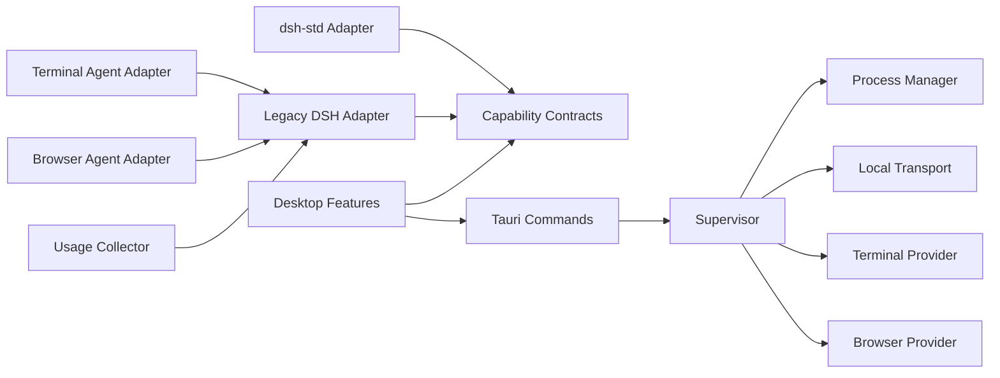

# Module Dependencies

允许依赖方向：

禁止：

- Rust crate 依赖 React feature。
- Capability contracts 依赖 Cordis、DSH 或 dsh-std types。
- Supervisor 直接 import DSH internals。
- Adapter 调用任意 native command，必须使用 versioned capability。
- UI 直接管理 child process 或 PTY。
- Browser/Terminal provider 决定 Agent 权限。
