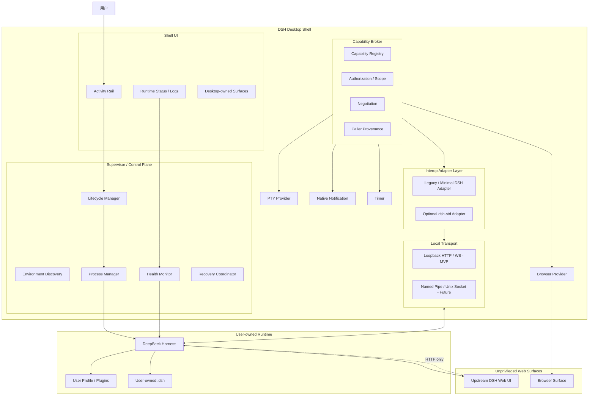
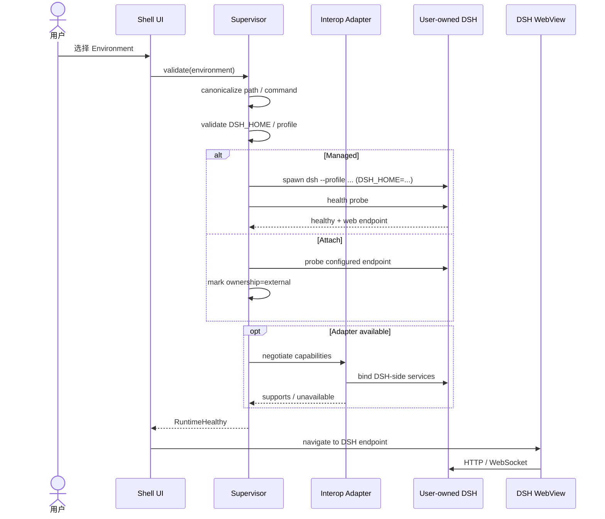
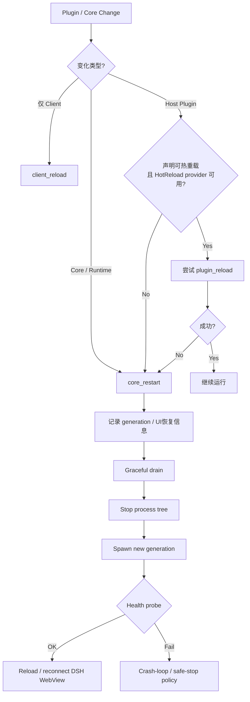
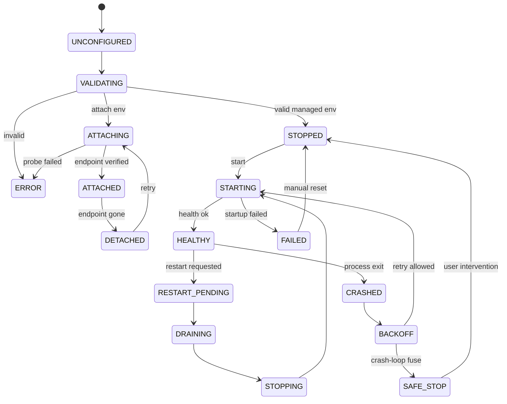
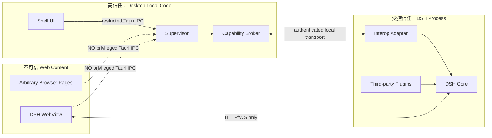
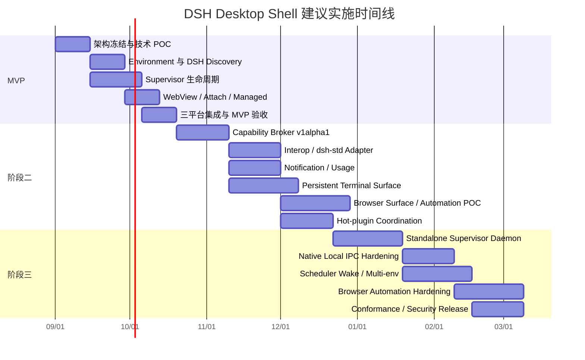
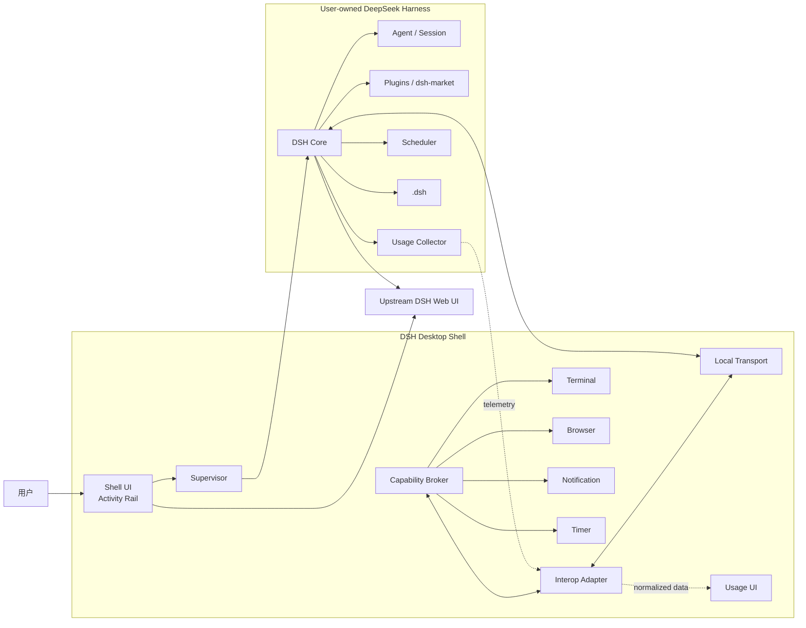

# DSH Desktop Shell 概念架构与可行性调研报告

## 执行摘要

本报告的核心结论是：**“DSH Desktop Shell”具有较高工程可行性，并且以“Desktop 作为 Supervisor / Control Plane、DSH 与 `.dsh` 由用户所有”为核心的薄壳架构，比把 Node、Harness Core、Profile 与插件整体重新打包进 Desktop 更符合“兼容性优先、低维护成本优先”的目标。**

截至 2026 年 8 月 25 日，DeepSeek Harness 官方仍明确标注为 Developer Preview，并警告未来存在兼容性破坏；与此同时，其架构已经高度 Profile/Plugin 化，`dsh --profile <name>`、`DSH_HOME`、Profile bundle、`dsh plugin` 等都已成为公开的运行模型。官方文档同时强调 “Everything is a Plugin”，Cordis 让工具、LLM adapter、文件访问乃至 agent loop 都以插件方式挂载。citeturn15search0turn15search7turn15search13turn15search16

因此，Desktop 最不应该做的事情，是把自己和这些快速变化的内部 API、Profile 格式、`node_modules` 布局、Web DOM 结构绑死。推荐架构是：

> **Desktop 管进程、窗口、原生能力和生命周期；DSH 管 Agent、Session、Profile、插件与业务语义；两者之间由极薄的 Capability Broker + Adapter 层衔接。**

这与正在形成的社区 `dsh-std` 思路高度一致。`dsh-std` 将自己定位为面向插件、runtime、TUI、Web、Desktop、headless daemon 的互操作协议集合，以领域无关的 meta-protocol 协商 `apiVersion + kind`，并强调“上游变化应收敛到 Adapter”。但它目前仍是早期草案；尤其 `connection` 包尚未标准化 discovery、authentication、encryption、reconnect、framing 和 serialization，因此**现在适合借鉴其模型，不适合让 Desktop 核心硬依赖其 npm package 或当前 wire format**。citeturn15search2turn16search0turn16search1

本报告建议确立以下产品定义：

> **DSH Desktop Shell = 专用 DSH 浏览器 + Native Capability Host + Runtime Supervisor。**

而不是：

> DSH Desktop Shell = DeepSeek Harness 的另一套发行版。

推荐的默认部署关系是：

```text
Desktop Shell       用户拥有
Supervisor          Desktop 拥有
Capability Broker   Desktop 拥有
Interop Adapter     可替换、可选
Local Transport     Desktop 拥有
DeepSeek Harness    用户拥有
.dsh                用户拥有
Plugins             用户 / DSH 拥有
```

现有 `deepseek-harness-desktop` 已经证明 Tauri 管理 DSH WebView、健康检查、进程生命周期、插件、Profile 和 Core 的总体技术路线可行；但其当前设计同时承担 Node/runtime、Harness Core、多版本、Profile、CLI shim、插件和更新管理。我们的方案建议把这一职责显著收窄：**用户已有 Core 是默认且唯一权威来源；Desktop 不再默认下载、patch 或升级 Core。** fileciteturn0file0L2-L2

综合判断：

| 子系统 | 可行性 | 主要风险 | 建议 |
|---|---|---|---|
| DSH WebView 外壳 | **高** | WebView 平台差异 | MVP |
| 用户已有 DSH discovery | **高** | 安装布局多样 | MVP |
| Managed / Attach 双模式 | **高** | PID/端口所有权判断 | MVP |
| Supervisor restart/recovery | **高** | 跨平台进程树 | MVP |
| Capability Broker | **高** | 过早设计私有 ABI | 阶段二 |
| dsh-std 兼容层 | **中高** | 标准仍在快速演化 | 阶段二，可选 |
| Native Notification | **高** | 低 | 阶段二 |
| Desktop-owned Terminal | **高** | PTY 权限、进程生命周期 | 阶段二 |
| Usage Dashboard | **中高** | DSH usage API 尚未稳定 | 阶段二 |
| Shared Browser Surface | **中高** | Tauri 与 Electron/CDP 模型不同 | 阶段二 POC |
| Agent Browser Automation | **中** | 浏览器引擎、权限与身份隔离 | 阶段二后半 |
| Persistent Scheduler Wake | **中高** | 无人值守权限模型 | 阶段三 |
| 独立 Supervisor Daemon | **高** | 产品复杂度提升 | 阶段三 |
| Desktop 自己管理插件市场 | **低收益** | 强耦合 Profile/pnpm | **不建议** |

**建议立项，且第一阶段严格限制范围。** MVP 不做插件市场、不做 Core 下载、不做 DOM injection、不做完整 dsh-std、不做 Agent Browser Automation。第一阶段只需要证明“外部 Core + 生命周期隔离 + 无侵入 Web UI”这一根基。

## 目标、范围与架构决策

### 产品目标与非目标

用户已经拥有：

```text
/path/to/deepseek-harness
或
dsh on PATH

以及

~/.dsh
```

DSH Desktop Shell 的任务不是再次制造一套 DSH，而是把它变成一个稳定的桌面工作环境：

```text
用户安装 Desktop Shell
        │
        ▼
首次启动 / Settings
        │
        ├─ 选择/探测 dsh
        ├─ 选择 DSH_HOME
        ├─ 选择 Profile
        └─ 验证
        │
        ▼
Supervisor 启动用户的 dsh
        │
        ▼
DSH Web UI
        │
        ▼
嵌入 Desktop
```

官方 CLI 当前明确以 `$DSH_HOME/profiles/<name>` 作为 Profile 启动根，并把 bundle patch、Profile `cordis.patch.yml`、Home-level patch 和命令行 `--patch` 依次组合；第三方插件也是通过 Profile 的 pnpm-managed `node_modules` 工作。这意味着 `.dsh` 和 Profile 实质上是用户的运行环境，而不是 Desktop 的附属缓存。citeturn15search14turn15search16

因此建议把“所有权”写成项目级架构规则：

| 对象 | 权威 Owner | Desktop 默认行为 |
|---|---|---|
| Desktop 配置 | Desktop | 读写 |
| Desktop UI | Desktop | 完全控制 |
| Supervisor | Desktop | 完全控制 |
| DSH 进程 | 用户；Managed 模式下由 Supervisor 临时拥有生命周期 | start/stop/restart |
| DSH 安装 | 用户 | **只读、不升级** |
| Node/pnpm | 用户/DSH | **不管理** |
| `.dsh` | 用户 | 默认仅作为 `DSH_HOME` 传递 |
| Profile | DSH/用户 | **不直接修改** |
| 插件 | DSH/用户 | **不直接安装/卸载** |
| DSH Web UI | upstream | **不 patch DOM** |
| Browser/PTY 等 native surface | Desktop | Desktop-owned |
| Agent/Session | DSH | Desktop 仅通过 Adapter 观察/调用 |

特别建议 Desktop 自己的状态不要塞入 `.dsh`，而是使用独立目录，例如：

```text
~/.config/dsh-desktop-shell/
```

或各平台标准 AppData/Application Support 路径。这样 `.dsh` 即使被用户替换、Git 管理、迁移或损坏，也不会把 Desktop 自己的环境记录一起破坏。

### Managed 与 Attach 必须成为两个明确模式

这是整个生命周期设计的基础。

**Managed External Core：**

```text
Desktop Supervisor
        │
        │ spawn
        ▼
      dsh PID
```

Supervisor 创建进程，因此可以合法地执行：

```text
start
stop
restart
health probe
crash recovery
process-tree cleanup
```

**Attach：**

```text
Existing DSH
     ▲
     │ HTTP / Interop
     │
Desktop
```

Desktop 没有创建 PID，因此默认不得：

```text
kill
restart
upgrade
```

Desktop UI 应明确显示：

```text
Backend

● Connected
Mode: Attached
Lifecycle: Externally managed
```

而不是试图根据“3080 端口上有东西”就接管进程。

这是一个非常重要的安全边界：**Connection ownership ≠ process ownership。**

### 架构选项比较

现有社区 Desktop 项目选择了更接近“完整发行版”的方案：Tauri/Rust 同时负责下载、Core 多版本、Profile、插件、CLI shim、更新和 DSH 进程生命周期，并嵌入 `127.0.0.1:3080` 的 Harness Web UI；它也会优先使用已经安装的本地 Core，但整个产品仍保留自己的 Core/runtime 管理链。fileciteturn0file0L2-L2

对于本项目的优先级，可以比较为：

| 方案 | 兼容性 | 维护成本 | 生命周期能力 | 用户环境一致性 | MVP 成本 | 评价 |
|---|---|---|---|---|---|---|
| Desktop 自带 Node + Core | 中 | **高** | 高 | **高** | 高 | 适合零配置发行版 |
| **薄 Shell + 内置 Supervisor + 用户 Core** | **高** | **低~中** | **高** | 中 | **低~中** | **推荐** |
| Attach-only Web wrapper | 高 | **最低** | 低 | 高 | 最低 | 过于简单 |
| 独立 Supervisor daemon + UI | **最高** | 中 | **最高** | 中 | 高 | 阶段三目标 |

需要强调一个容易误判的问题：

> 使用用户已有 Core **不会消除兼容性问题，而是改变兼容性问题的性质**。

Bundled 模式主要面对：

```text
Desktop version
× Core version
× Node version
× pnpm version
× plugin version
```

External-Core 模式则主要面对：

```text
启动协议
× DSH Web HTTP surface
× optional adapter
× 用户环境差异
```

后者通常更容易隔离和测试，因此更符合本项目“低维护”的目标。

### 不修改 upstream Web UI 应成为硬边界

推荐的窗口结构不是：

```text
DSH Web
   +
DOM injection
   +
Monkey patch
   +
Desktop-only React components
```

而是：

```text
┌─────────────────────────────────────────────┐
│ DSH Desktop Shell                           │
├────┬────────────────────────────────────────┤
│    │                                        │
│ D  │                                        │
│ S  │         Upstream DSH WebView           │
│ H  │                                        │
│    │                                        │
│ 🌐 │                                        │
│ >_ │                                        │
│ 📊 │                                        │
│ ◷  │                                        │
│ ⚙  │                                        │
└────┴────────────────────────────────────────┘
```

左侧是极窄的 Desktop Activity Rail，右侧是完整 upstream DSH surface。

Tauri 2 可以创建独立 WebView/WebviewWindow，并通过 capability 文件针对具体 window/webview 分配权限；Tauri 官方同时强调 capability 是 WebView 到系统 IPC 的权限边界。citeturn16search2turn16search3turn17search8

因此推荐：

```text
Shell UI WebView
    → 有受限 Tauri IPC

DSH WebView
    → 零 Tauri privileged IPC

Browser WebView
    → 零 Tauri privileged IPC
```

这比给 DSH 页面注入：

```js
window.__DSH_DESKTOP__
```

安全且兼容得多。

## 概念架构与互操作协议

### 目标组件架构

推荐的逻辑架构如下：



这里刻意把 **Capability Broker** 和 **Interop Adapter** 分开：

- Broker 定义 Desktop 自己稳定的内部能力模型；
- Adapter 决定如何把这些能力映射到某一代 DSH；
- Transport 只负责“怎么传输”，不包含能力业务语义。

这与社区 RFC 提出的“插件 → 稳定契约 → Capability Broker → versioned DSH Adapter → unmodified official runtime”非常接近；RFC 同时明确 Adapter 应是唯一吸收 upstream 变化的层。citeturn16search1

### dsh-std 的正确接入方式

`dsh-std` 当前最值得直接吸收的是四项思想：

```text
apiVersion + kind
per-capability version
requires / supports negotiation
adapter absorbs upstream change
```

它目前明确定位 `@dsh-std/core` 为领域无关 meta-protocol；Command、Model、Tool、Presentation 等领域协议独立版本化。其设计目标之一就是让 Desktop/TUI/Web/headless 等宿主只实现自己需要的部分。citeturn15search2turn16search1

但本项目不应：

```text
import @dsh-std/*
        ↓
Desktop Core types
        ↓
所有模块直接依赖当前 alpha API
```

更稳妥的是：

```text
                    Internal Capability Model
                              │
               ┌──────────────┴───────────────┐
               ▼                              ▼
        dsh-std adapter                legacy/minimal adapter
               │                              │
               └──────────────┬───────────────┘
                              ▼
                             DSH
```

建议形成一条明确的工程规则：

> **DSH Desktop Shell SHALL NOT require dsh-std; DSH Desktop Shell SHOULD be dsh-std-compatible.**

尤其不能把 `@dsh-std/connection` 当成现成的 wire protocol。它当前的官方 README 明确表示尚未标准化 discovery、authentication、encryption、reconnect policy、framing 和 serialization，当前 memory implementation 主要用于测试与 conformance experiments。citeturn16search0

所以：

```text
Semantic protocol
    → dsh-std compatible

Transport
    → 我们先自行负责
```

未来标准成熟后替换 transport adapter，而不是重写 Terminal、Browser、Supervisor。

另外，RFC v0.15 当前只正式收窄规范 `host` facet，而把 `client` / `worker` 留给后续 RFC。因此本项目**不应现在擅自定义“desktop facet”并宣称它属于 dsh-std**；Desktop 应先作为 Host/Capability Provider 存在。citeturn16search1

### 启动和连接流程



第一次配置建议使用 Application Setup，而不是强行塞到 MSI/DMG 安装过程里：

```yaml
environment:
  id: dev
  name: "DSH Dev"

  launch:
    command: "D:/repo/deepseek-harness/..."
    cwd: "D:/repo/deepseek-harness"

  dshHome: "C:/Users/alice/.dsh"
  profile: "web"

  ownership: managed

  web:
    host: "127.0.0.1"
    port: auto
```

这样移动 Harness repo、切换 Profile 或更换 `.dsh` 都无需重新安装 Desktop。

### 可选 Adapter 的非侵入挂载

官方 CLI 当前允许命令行 `--patch <path>` 作为最后一层 overlay，并明确 Profile、本机 Home patch 与启动 patch 的组合顺序。citeturn15search16

因此值得做一个 POC：

```text
Desktop Shell
   │
   ├─ 不修改 user profile
   │
   └─ Managed start 时增加 transient --patch
             │
             ▼
        DSH Desktop Adapter
```

理想情况下可以：

```text
用户原 profile
      +
Desktop runtime-only patch
      ↓
只对这一轮 Managed DSH 生效
```

Desktop 退出后，用户的 Profile manifest / `cordis.patch.yml` 没被永久改动。

这是一条**建议验证而非现在假定成立的实现路径**：需要针对目标 DSH 版本确认外部 Adapter module 的解析与依赖方式。若某版 DSH 不适合 transient patch，则退回：

```text
baseline mode:
    process + web only

enhanced attach mode:
    user explicitly installs companion adapter
```

这使 Adapter 成为增强能力，而不是 Desktop 启动前置条件。

### IPC / Bridge 草案

建议 wire protocol 与 capability protocol 分离。MVP 可使用：

```text
127.0.0.1:<random-port>
HTTP + WebSocket
ephemeral token
```

阶段三再替换为：

```text
Windows Named Pipe
Unix Domain Socket
```

但 envelope 不变。

基础 JSON Schema 可以设计为：

```json
{
  "$schema": "https://json-schema.org/draft/2020-12/schema",
  "$id": "urn:dsh-desktop-shell:ipc-envelope:v1alpha1",
  "title": "DSH Desktop Shell IPC Envelope",
  "type": "object",
  "additionalProperties": false,
  "required": [
    "protocol",
    "id",
    "type",
    "capability",
    "method",
    "body"
  ],
  "properties": {
    "protocol": {
      "const": "dsh-desktop-shell-ipc/v1alpha1"
    },
    "id": {
      "type": "string",
      "minLength": 16,
      "maxLength": 128
    },
    "type": {
      "enum": ["request", "response", "event"]
    },
    "replyTo": {
      "type": "string"
    },
    "capability": {
      "type": "object",
      "additionalProperties": false,
      "required": ["apiVersion", "kind"],
      "properties": {
        "apiVersion": {
          "type": "string",
          "pattern": "^[a-z0-9.-]+/v[0-9]+(alpha|beta)?[0-9]*$"
        },
        "kind": {
          "type": "string",
          "pattern": "^[A-Z][A-Za-z0-9]+$"
        }
      }
    },
    "method": {
      "type": "string",
      "pattern": "^[a-z][a-z0-9._-]+$"
    },
    "generation": {
      "type": "integer",
      "minimum": 0
    },
    "body": {
      "type": "object"
    },
    "error": {
      "type": "object",
      "additionalProperties": false,
      "required": ["code", "message"],
      "properties": {
        "code": {
          "type": "string"
        },
        "message": {
          "type": "string"
        },
        "retryable": {
          "type": "boolean"
        }
      }
    }
  }
}
```

`generation` 很有价值。每次 DSH Core 重启：

```text
generation 41
   ↓ restart
generation 42
```

旧 WebView、旧 Adapter 或迟到的 RPC response 就不能被错误解释为当前 Core 的状态。

协商请求：

```json
{
  "protocol": "dsh-desktop-shell-ipc/v1alpha1",
  "id": "019d-73ac-7f30-ae0c",
  "type": "request",
  "capability": {
    "apiVersion": "x-dsh-shell.meta/v1alpha1",
    "kind": "Negotiation"
  },
  "method": "negotiate",
  "body": {
    "requires": [
      {
        "apiVersion": "x-dsh-shell.runtime/v1alpha1",
        "kind": "RuntimeStatus"
      }
    ],
    "optional": [
      {
        "apiVersion": "x-dsh-shell.notify/v1alpha1",
        "kind": "Notification"
      },
      {
        "apiVersion": "x-dsh-shell.usage/v1alpha1",
        "kind": "UsageTelemetry"
      }
    ]
  }
}
```

响应：

```json
{
  "protocol": "dsh-desktop-shell-ipc/v1alpha1",
  "id": "019d-73ac-8a1a-dc53",
  "type": "response",
  "replyTo": "019d-73ac-7f30-ae0c",
  "capability": {
    "apiVersion": "x-dsh-shell.meta/v1alpha1",
    "kind": "Negotiation"
  },
  "method": "negotiate",
  "body": {
    "granted": [
      {
        "apiVersion": "x-dsh-shell.runtime/v1alpha1",
        "kind": "RuntimeStatus"
      },
      {
        "apiVersion": "x-dsh-shell.notify/v1alpha1",
        "kind": "Notification"
      }
    ],
    "unavailable": [
      {
        "apiVersion": "x-dsh-shell.usage/v1alpha1",
        "kind": "UsageTelemetry",
        "reason": "provider_unavailable"
      }
    ]
  }
}
```

这里故意采用 `apiVersion + kind`，与 dsh-std/RFC 的 meta-protocol 思路一致，但 `x-dsh-shell.*` 应明确标记为**项目私有实验命名空间，而不是 dsh-std 正式标准**。社区 RFC 本身也建议私有扩展使用组织命名空间，并用 `v1alpha1` 坦率标记 breaking-change 风险。citeturn16search1

认证信息不应进入 JSON envelope，而应属于 transport：

```text
HTTP Authorization
Named Pipe ACL
Unix socket filesystem permissions
```

否则 schema 本身会开始承担它不该承担的安全语义。

## 能力模型与运行时生命周期

### Capability 规划

建议初期不要定义：

```ts
interface DesktopBridge {
  everything(): any
}
```

而按领域独立版本化。

| Capability | 建议坐标 | 阶段 | Provider | 风险级 | 设计备注 |
|---|---|---:|---|---|---|
| RuntimeStatus | `x-dsh-shell.runtime/v1alpha1` | MVP | Supervisor | 低 | health、generation、ownership |
| RuntimeControl | `x-dsh-shell.runtime/v1alpha1` | MVP | Supervisor | **高** | managed-only |
| RuntimeDiagnostics | `x-dsh-shell.runtime/v1alpha1` | MVP | Supervisor | 中 | 日志必须脱敏 |
| Notification | `x-dsh-shell.notify/v1alpha1` | 二 | Desktop | 低~中 | DSH 决定何时通知，Desktop 决定怎么展示 |
| Timer | `x-dsh-shell.timer/v1alpha1` | 二 | Desktop | 低 | stopwatch/countdown，不等于 Agent Scheduler |
| TerminalSurface | `x-dsh-shell.terminal/v1alpha1` | 二 | Desktop | **高** | 面向人类的 Desktop PTY |
| TerminalAutomation | `x-dsh-shell.terminal/v1alpha1` | 二/三 | Broker | **极高** | 与用户 Terminal 明确隔离、opt-in |
| BrowserSurface | `x-dsh-shell.browser/v1alpha1` | 二 | Desktop | 中 | 可见浏览器 |
| BrowserAutomation | `x-dsh-shell.browser/v1alpha1` | 二/三 | Browser Provider | **极高** | Agent actions + explicit guard |
| FileDialog | `x-dsh-shell.system/v1alpha1` | 二 | Desktop | 中 | 必须 user gesture |
| Clipboard | `x-dsh-shell.system/v1alpha1` | 二 | Desktop | 高 | read 与 write 单独授权 |
| ExternalOpen | `x-dsh-shell.system/v1alpha1` | 二 | Desktop | 中 | URL/scheme 校验 |
| UsageTelemetry | `x-dsh-shell.usage/v1alpha1` | 二 | DSH Adapter | 中 | DSH 采集，Desktop 展示 |
| ScheduleWake | `x-dsh-shell.scheduler/v1alpha1` | 三 | Supervisor | **高** | 只负责唤醒 Core，不负责 Agent 业务调度 |

推荐所有第一代 capability 先使用 `v1alpha1`。等字段语义、错误码和兼容测试稳定后：

```text
v1alpha1
  ↓
v1beta1
  ↓
v1
```

不要使用：

```text
DesktopProtocolVersion = 7
```

这种“大一统版本”。一个稳定的 Desktop 应该允许：

```text
Runtime v1
Browser v1alpha2
Usage v1alpha1
Notification v1
```

同时存在。这正是 dsh-std 当前独立领域协议版本化所要解决的问题。citeturn15search2turn16search1

### Browser 与 Terminal 要区分“Surface”和“Automation”

这是一个非常重要的权限设计。

例如：

```text
TerminalSurface
```

意味着用户自己打开一个 shell：

```text
┌───────────────────────┐
│ PowerShell            │
│ PS D:\repo>           │
└───────────────────────┘
```

它不能自动推出：

```text
Agent 可以向这个 Terminal 任意 sendKeys
```

后者是完全不同的高权限能力：

```text
TerminalAutomation
```

Browser 同理：

```text
BrowserSurface
    ≠
BrowserAutomation
```

社区 `wqty123/dsh-browser` 已经很好地验证了“Human 与 Agent 共用真实可见 Browser”的产品模式：其 Electron 实现将 agent `browser_*` tools、浏览器 service seam、Electron provider 和 shell-provided view host 分离；用户可以看到 Agent 操作并接管，同时工具层与具体 Electron 实现解耦。其 README 甚至明确认为 Browser column/layout 应由 host shell 所有。citeturn19view0

这与我们的分层高度吻合：

```text
DSH Agent Tools
      │
      ▼
Browser capability seam
      │
      ▼
Desktop Browser Provider
      │
      ▼
Visible Browser Surface
```

但不能直接照搬其 Electron provider：该插件依赖 `WebContentsView + webContents.debugger/CDP`，而 Tauri 使用自己的系统 WebView API。由此推断，如果坚持 Tauri，则需要重新实现 provider，或者使用外部 Chrome/Edge CDP；不能假定 ElectronBrowserViewHost 可以原样接入 Tauri。Tauri 本身支持创建独立/远程 URL WebView，但这只解决“显示页面”，并不自动提供 Electron 式统一 CDP 自动化层。citeturn19view0turn17search0turn17search8

因此 Browser 建议分阶段：

```text
Stage 2A
BrowserSurface
    ↓
用户使用

Stage 2B
BrowserAutomation provider
    ↓
Agent 使用
```

不要让浏览器引擎选择阻塞整个 Desktop MVP。

Terminal 也类似。社区 Better Sidebar 已经把终端、文件、Git 和第三方 tab 组合成工作台，市场首页也显示这一类 workbench 是当前生态的核心需求之一。citeturn18search0turn18search1

但 Desktop-owned PTY 有社区插件无法轻易提供的一项优势：

```text
Supervisor
 ├── PTY #1 ────────────────────────────
 ├── PTY #2 ────────────────────────────
 │
 └── DSH generation 41
             ↓ restart
       DSH generation 42
```

**DSH 重启时用户 Terminal 可以不死。**

这会使 Desktop 从“网页壳”真正升级为“持久工作环境”。

### Usage 和 Scheduler 的归属

用量统计不建议 Desktop 直接长期解析：

```text
~/.dsh/session logs
```

作为正式 API。

社区 `dsh-deepseek-usage-dashboard` 当前确实能从 Session logs/官方 replayable projection seam 采集真实 provider usage，并把 cache hit/miss、output、reasoning、费用估算和余额展示出来；它也刻意不修改 DSH source。citeturn20view1

这很好地说明：

```text
DSH
  → 最了解 usage 语义

Desktop
  → 最适合长期展示 usage
```

因此推荐：

```text
DSH Usage Adapter
       │
       │ normalized telemetry
       ▼
Desktop Usage Dashboard
```

而不是：

```text
Desktop
    ↓
猜 session.jsonl 当前格式
```

如此 DSH 日志格式改变时，只改 Adapter。

Scheduler 同样应分清：

```text
Desktop Timer
        ≠
Agent Scheduler
```

普通：

```text
25 min Pomodoro
30 min countdown
```

属于 Desktop。

而：

```text
每天 09:00
启动 Agent 检查测试失败
```

属于 DSH。

`titanwings/dsh-automation` 当前已经采用“每次计划任务启动 fresh root Agent + fresh Session + durable run history”的结构，并显式保留 workspace 与 permission boundary；它还明确说明 DSH Host 必须保持运行，当前不是 OS daemon。citeturn20view0

因此阶段三 Desktop 可以补上它缺少的这一层：

```text
09:00
  │
  ▼
Supervisor sees wakeup
  │
  ├─ Core already running → dispatch
  │
  └─ Core stopped
       ↓
      start
       ↓
      healthy
       ↓
   request scheduled Agent run
```

但 Desktop **只负责 wake**，不重新实现任务定义、Agent Session 和 permission policy。

### Restart 与 Hot-plugin 策略

Restart 不应是一个 Boolean：

```text
restartRequired = true/false
```

而建议定义：

| 策略 | 作用范围 | 示例 |
|---|---|---|
| `none` | 无 | 设置即时生效 |
| `client_reload` | DSH WebView/client | client bundle/UI 更新 |
| `plugin_reload` | 某 Host plugin | Cordis safe hot reload |
| `core_restart` | DSH child process | Host plugin不可热载、Core更新 |
| `supervisor_restart` | Supervisor | Supervisor 升级 |
| `shell_restart` | Desktop UI | Desktop 自更新 |

社区 `dsh-hot-reload` 已经验证了中间层的价值：它监视插件版本变化，在运行中的 DSH 进程里重新 import/instantiate plugin，失败时保留或恢复旧版本；它也明确声明“不会替你重启 DSH，restart 留给你或 supervisor”。更重要的是，该实现依赖 Cordis loader internals，因此未来 DSH 变化时可能需要跟进；对于裸 `setInterval`、`net/http` server、`WebSocketServer`、`fs.watch`、`child_process` 等不通过 `ctx` 生命周期管理的资源，它无法保证没有静默泄漏。citeturn19view1

因此 Shell 的原则应该是：

> **Hot reload 是优化，Supervisor restart 是可靠兜底。**

推荐决策流：



Supervisor 状态机建议：



建议的初始 crash-loop fuse 可以配置为：

```text
例如：60 秒内最多自动恢复 3 次
```

超过即：

```text
SAFE_STOP
```

而不是无限 restart。这个数值是工程初始建议，后续应通过测试调整。

Restart 请求示例：

```json
{
  "protocol": "dsh-desktop-shell-ipc/v1alpha1",
  "id": "019d-73ad-41e4-a912",
  "type": "request",
  "capability": {
    "apiVersion": "x-dsh-shell.runtime/v1alpha1",
    "kind": "RuntimeControl"
  },
  "method": "restart",
  "generation": 41,
  "body": {
    "reason": "plugin_update",
    "mode": "graceful"
  }
}
```

若当前是 Attach Mode：

```json
{
  "protocol": "dsh-desktop-shell-ipc/v1alpha1",
  "id": "019d-73ad-42cc-c853",
  "type": "response",
  "replyTo": "019d-73ad-41e4-a912",
  "capability": {
    "apiVersion": "x-dsh-shell.runtime/v1alpha1",
    "kind": "RuntimeControl"
  },
  "method": "restart",
  "body": {},
  "error": {
    "code": "NOT_PROCESS_OWNER",
    "message": "The backend is attached and externally managed.",
    "retryable": false
  }
}
```

这类错误码应该从第一版就标准化。

## 安全、供应链与兼容性

### 最重要的安全假设：DSH Plugin 不是沙箱内代码

当前社区 RFC v0.15 对这一点写得非常清楚：capability declaration 用于 compatibility、authorization 和 audit，**不是 sandbox**；当前模型属于 trusted-in-process，插件代码理论上可以绕过 `ctx` 直接调用 Node 系统接口。citeturn16search1

市场本身也在安装页面直接警告：第三方插件以用户权限执行，可以读取文件、使用凭据并访问网络。citeturn19view0turn19view1turn20view0turn20view1

因此必须把 Desktop Trust Zone 画清楚：



这里有一个很容易忽略的事实：

假设 MVP 把：

```text
DSH_DESKTOP_ENDPOINT
DSH_DESKTOP_TOKEN
```

放进 DSH process environment，那么所有同进程第三方 Node plugin 理论上都可能读取这些环境变量。

所以这个 token 能证明：

> “调用者来自这个 DSH process。”

但不能证明：

> “调用者是插件 A，而不是插件 B。”

这正是“capability declaration 不是 sandbox”的实际含义。citeturn16search1

因此第一代 Adapter 绝不能直接获得：

```text
arbitrary terminal exec
arbitrary filesystem access
clipboard read
unrestricted browser automation
```

这些高权限操作必须要求更强的 provenance / user approval，或者等 dsh-side Broker 能可靠归属调用者以后开放。

### Tauri 权限边界

Tauri 2 的 capability/permission 系统支持针对具体 window/webview 分配命令和 scope；文件系统、shell 等潜在危险 plugin command 默认被阻止，需要显式授予。citeturn16search2turn16search3turn16search5turn17search1

这正适合我们的三 WebView 模型：

| WebView | 权限 |
|---|---|
| Shell UI | 极小的 Desktop command allowlist |
| DSH Web | **无 privileged Tauri API** |
| Browser Surface | **无 privileged Tauri API** |

尤其不要出现：

```text
DSH WebView
   ↓
shell.execute(...)
```

Tauri Shell plugin 自己也把危险命令和 scope 默认关闭。citeturn17search1

推荐把 Desktop 前端能调用的 Tauri command 限制成：

```text
environment.list
environment.select
runtime.status
runtime.start
runtime.stop
runtime.restart
surface.show
surface.hide
settings.read
settings.write
```

而不是：

```text
exec(command: string)
readFile(path: string)
spawn(anything)
```

真正的系统操作应在 Rust 后端内部完成结构化参数校验。

### Node build scripts 与插件供应链

这是整个 DSH 生态里需要严肃处理的风险。

pnpm 官方明确说明，供应链攻击过去经常利用 dependency `postinstall` 执行恶意代码；pnpm 当前建议不要启用 `dangerouslyAllowAllBuilds`，而使用显式 `allowBuilds` 只批准可信依赖。`pnpm approve-builds` 会把明确批准/拒绝的 package 写入 `allowBuilds`。citeturn17search2turn17search10

pnpm 11 进一步把 `allowBuilds` 作为新的统一机制，并强化供应链默认保护。citeturn17search6

npm 12 也已经采用类似思路：dependency install script 默认阻止，没有出现在 `allowScripts` 中的依赖不会运行安装脚本。citeturn17search11turn17search14

因此 Shell 应执行以下策略：

| 行为 | 默认政策 |
|---|---|
| Desktop 自动执行 `pnpm add plugin` | **禁止** |
| Desktop 自动批准 build script | **禁止** |
| `dangerouslyAllowAllBuilds` | **永不自动启用** |
| 用户明确批准 package build | 精确 package/version allowlist |
| Git plugin | 优先固定 commit SHA |
| Git branch + build script | 高风险，显著警告 |
| 插件升级后新增 build script | 重新审批 |
| Native addon | 单独标记 |
| Desktop companion adapter | 尽量 prebuilt + zero install script |

尤其值得注意：pnpm 近期已经允许 Git-hosted `allowBuilds` 通过 repository URL 匹配，而不必绑定 resolved commit hash。这对开发方便，但意味着“批准 repo URL”可能让后续 branch 更新继续拥有 build-script 权限，因此对于 Desktop 的安全 UI，**更保守的做法仍然是 pin commit / reviewed release，而不是永久信任一个移动的 Git branch。** citeturn17search16

社区已有很好的正面范例：`titanwings/dsh-automation` 直接发布构建好的 Host/Web bundle，Git 安装没有 package build script，也不需要 `allowBuilds`。这正是我们自己的 companion adapter 应采用的风格。citeturn20view0

另外，官方/社区近期确实已有 Profile/pnpm 相关边缘问题报告，例如 workspace-root install 检查、插件依赖状态不一致、stale bundle entry 和重复 runtime package instance。这些报告不代表所有用户都会遇到，但足以说明 Desktop 不应该复制一套自己的 Profile mutation 逻辑。citeturn15search4turn15search6turn15search8turn15search18

因此最安全的 ownership rule 是：

> **插件安装、删除、更新由 DSH/市场负责；Desktop 只观察结果与协调 reload/restart。**

### 插件操作建议采用事务思维

即便 Desktop 不成为插件管理器，也应为未来 Adapter 预留这类事件：

```text
PluginOperationStarted
PluginOperationNeedsApproval
PluginOperationBuildScriptsBlocked
PluginOperationCompleted
PluginReloadSucceeded
CoreRestartRequired
PluginOperationRolledBack
```

如果未来 Shell 提供“打开 DSH Market”快捷入口，其职责应该是：

```text
Desktop button
      ↓
DSH Market page
```

而不是：

```text
Desktop 自己解析 package.json
        ↓
自己 pnpm add
        ↓
自己改 cordis.patch.yml
```

当前 dsh-market 已经形成千级插件目录，并负责 browse/search/install 等用户侧流程；市场与插件页面同时显式提醒第三方代码权限风险。citeturn18search0turn19view0

### WebView 到系统能力必须 Fail Closed

建议将任何不符合能力协商的调用都处理为：

```text
UNAVAILABLE
UNAUTHORIZED
UNSUPPORTED_VERSION
NOT_PROCESS_OWNER
USER_GESTURE_REQUIRED
USER_DENIED
```

绝不做“猜测兼容”。

这与社区 RFC 对 Adapter 的要求一致：如果 upstream 的观察点消失，Adapter 应关闭 capability 并解释原因，而不是用私有 patch 猜一个“似乎成功”的结果。citeturn16search1

例如：

```text
DSH 0.1.0-rc.X
usage seam disappeared
        ↓
UsageTelemetry = unavailable
        ↓
Desktop Usage 页面显示
"此 DSH 版本暂不支持精确用量采集"
```

而不是偷偷解析内部 JSON 猜数据。

### 与 DeepSeek Harness 的兼容策略

官方当前仍明确承认 breaking changes，因此推荐建立三层兼容模式。citeturn15search7

**Baseline compatibility：**

```text
dsh process
+
HTTP Web UI
```

只需要：

```text
能启动
能得到 HTTP endpoint
```

即可拥有 Desktop 基本功能。

**Enhanced compatibility：**

```text
baseline
+
minimal adapter
```

得到：

```text
usage
notification semantics
restart reason
session identity
plugin lifecycle hints
```

**Standard-compatible compatibility：**

```text
enhanced
+
dsh-std-compatible negotiation
```

因此即便 Adapter 在新 DSH 版本上暂时坏掉：

```text
Terminal Desktop Surface
Browser manual Surface
Core lifecycle
DSH Web UI
```

仍然应该能工作。

这就是“降级而不是整体爆炸”。

### 与 dsh-std 的兼容策略

建议 CI 中实现：

```text
Internal broker fixture
      │
      ├─ no dsh-std
      ├─ known compatible dsh-std alpha
      └─ unknown/incompatible dsh-std
```

输出必须清晰：

```text
supported
unsupported
degraded
```

而不能因为检测到 `@dsh-std/*` 就盲目调用。

当前 `dsh-std`/RFC 最值得直接对齐的是：

| 概念 | Shell 是否采用 |
|---|---|
| `apiVersion + kind` | **采用** |
| Capability 独立版本 | **采用** |
| requires/supports | **采用** |
| Adapter-only upstream coupling | **采用** |
| 静态能力描述 | 建议采用 |
| Capability = sandbox | **明确不采用** |
| 当前 `connection` wire | **不绑定** |
| 当前 npm types 作为 Shell public ABI | **不绑定** |
| 自定义 desktop facet | **暂不定义** |

`dsh-std` 当前代码和 proposals 本身也被仓库定位为早期 draft；社区 RFC 同时强调参考实现本身不自动成为标准。citeturn15search2turn16search1

### 与现有插件市场的兼容策略

目标应是：

```text
Ordinary DSH Plugin
      │
      ▼
Original DSH
      │
      ▼
Works inside Desktop unchanged
```

普通插件完全不需要知道 Desktop 存在。

只有确实需要 native provider 的插件：

```text
Browser
Notification
Terminal
File Dialog
Desktop lifecycle
```

才：

```text
Plugin / Adapter
       ↓ optional
Capability Broker
       ↓
Desktop Provider
```

这避免形成：

> “所有 DSH 插件为了支持某 Desktop 都必须适配一套专有 API”

这种生态分裂。

## 实施路线、资源与验证

### 推荐技术栈

鉴于现有 Desktop 已经证明 Tauri/Rust 驱动 DSH WebView 与进程生命周期可行，本项目仍推荐 Tauri 2 作为默认 Shell 技术。现有项目在 Windows/macOS/Linux 上使用 Tauri WebView + Rust lifecycle manager，并实际处理 DSH health/lifecycle。fileciteturn0file0L2-L2

推荐：

| 层 | 技术 |
|---|---|
| Desktop | Tauri 2 |
| Supervisor | Rust |
| Async / lifecycle | Rust async runtime |
| Shell UI | React + TypeScript |
| Bundler | Vite |
| IPC schemas | JSON Schema 2020-12 |
| Internal serialization | `serde` / JSON |
| DSH Adapter | TypeScript/ESM |
| Terminal | Rust PTY / 平台 PTY API，POC 后定 |
| Browser surface | Tauri WebView provider |
| Browser automation | 独立 provider；Chrome/Edge CDP 或其他实现 POC |
| Storage | Desktop config store；不把 Desktop state 混进 `.dsh` |
| Logs | Rust structured logs + redaction |
| Tests | Rust unit/integration + TS contract + cross-platform E2E |

Terminal 的 native implementation 建议优先考察 Rust PTY，而不是让 Desktop 自己再引入 `node-pty`，原因之一就是避免为 Desktop 新增一条 Node native addon/build-script 供应链。社区实现可以作为 UX/协议参考，而非依赖实现。

### MVP

MVP 的目标只有一句话：

> **证明 Desktop 与 User-owned DSH 真正解耦。**

范围：

| 能力 | MVP |
|---|---|
| Environment 配置 | ✅ |
| DSH path/command | ✅ |
| `DSH_HOME` | ✅ |
| Profile | ✅ |
| Managed mode | ✅ |
| Attach mode | ✅ |
| DSH WebView | ✅ |
| Health probe | ✅ |
| Restart | ✅ |
| Crash recovery | ✅ |
| Logs | ✅ |
| No-DOM-injection | ✅ |
| Capability Broker full protocol | ❌ |
| dsh-std package dependency | ❌ |
| Terminal | ❌ |
| Browser Automation | ❌ |
| Plugin manager | ❌ |
| Core downloader | ❌ |

MVP 退出标准建议为：

```text
Windows/macOS/Linux
       ×
global-installed dsh
source-checkout dsh
       ×
managed/attach
       ×
start/stop/restart/crash
       ×
clean/profile-heavy environment
```

至少完成稳定运行。

Linux 应特别覆盖 X11/Wayland，因为现有 Tauri Desktop 已在 README 中记录 WebKitGTK/Wayland 环境存在黑屏或崩溃类兼容问题，需要专门 fallback。fileciteturn0file0L2-L2

### 阶段二

目标从：

```text
DSH Browser Wrapper
```

升级到：

```text
DSH Desktop Workbench
```

实现：

```text
Capability Broker v1alpha1
Local IPC v1alpha1
Optional DSH Adapter
Optional dsh-std Adapter
Native Notifications
Usage
Desktop-owned Terminal
BrowserSurface
Hot-plugin / restart coordination
```

BrowserAutomation 在这一阶段先做 POC，不应成为阶段二整体 release blocker。

建议优先顺序：

```text
Broker
  ↓
Notification
  ↓
Usage
  ↓
TerminalSurface
  ↓
BrowserSurface
  ↓
BrowserAutomation POC
```

原因是 Notification/Usage/Terminal 技术风险明显低于跨平台共享 Browser automation。

社区插件已经分别验证这些产品需求：Better Sidebar 展示 workbench/terminal/tab 模型；Usage Dashboard 展示精确 token/余额数据；dsh-notification 展示 turn completion notification；dsh-browser 展示可见 Shared Browser；dsh-hot-reload 展示 hot plugin + Supervisor fallback 的价值。citeturn18search1turn20view1turn19view2turn19view0turn19view1

### 阶段三

阶段三再实现真正的：

> **Shell / Supervisor / DSH 三生命周期隔离。**

从：

```text
dsh-desktop-shell
     ├─ React
     └─ Rust Supervisor
             ↓
            DSH
```

拆成：

```text
dsh-desktop-shell.exe
          │
       local IPC
          │
          ▼
dsh-supervisor
          │
          ▼
user-owned dsh
```

这样：

```text
Shell restart/update
      │
      X
Supervisor still running
      │
DSH still running
```

以及：

```text
DSH restart
      │
      X
Terminal survives
Browser surface can survive
Supervisor survives
Shell survives
```

阶段三主要里程碑：

| 项目 | 目标 |
|---|---|
| Standalone Supervisor | UI 生命周期独立 |
| Named Pipe / UDS | 替代 loopback control plane |
| Multi-environment | stable/dev/experimental |
| Persistent PTY | DSH restart 不影响用户终端 |
| Scheduler wake | DSH 停止时可按计划唤醒 |
| Browser Automation provider | 权限化 Agent browser |
| dsh-std conformance adapter | 可选 |
| Security hardening | threat model + fuzz/negative tests |
| Update separation | Shell 与 DSH 完全独立更新 |

### 甘特式时间线

以下是**工程估算**，不是社区项目承诺。假设约 3 名核心工程师并行工作，另有部分 QA/Security 支持：



### 人月估算

在不开发自己的插件市场、不 fork DSH Web UI、不自研浏览器内核的条件下，本报告估计：

| 阶段 | 工程人月 |
|---|---:|
| MVP | **4–6** |
| 阶段二 | **7–10** |
| 阶段三 | **6–9** |
| 总体 | **17–25 人月** |

较合理的核心团队是：

```text
1 × Rust / Tauri / OS Integration
1 × TypeScript / DSH / Cordis / Protocol
1 × Cross-platform / UI / Integration
+
0.3~0.5 × QA / Security / Release
```

如果 BrowserAutomation 必须做到：

```text
Windows
macOS
Linux
×
real browser
×
human takeover
×
cookie partition
×
download
×
agent automation
```

则建议额外预留 **2–4 人月**。这是目前最大的不确定项。

### 测试矩阵

DSH 当前仍处 rapid breaking-change 阶段，因此兼容性不能依靠一次手工测试。citeturn15search7

建议 CI/Release Test Matrix：

| 维度 | 测试组合 |
|---|---|
| Windows | Windows 10/11 x64 |
| macOS | arm64 + Intel 支持目标 |
| Linux | Ubuntu 22.04/24.04，X11 + Wayland |
| WebView | WebView2 / WKWebView / WebKitGTK |
| DSH | latest published + N-1 + upstream main compatibility job |
| Core 来源 | PATH / global install / source checkout / custom executable |
| Ownership | Managed / Attach |
| `.dsh` | clean / mature / plugin-heavy |
| Plugin state | 正常 / build blocked / broken bundle / missing dep |
| Port | free / occupied / hijacked / delayed release |
| Process | normal exit / crash / hang / orphan children |
| Restart | user / plugin change / core update / crash recovery |
| dsh-std | absent / known alpha / incompatible alpha |
| IPC | missing token / invalid token / replay / malformed schema |
| Navigation | DSH origin / external URL / malicious page |
| Terminal | shell exit / child processes / DSH restart |
| Browser | auth / external navigation / download / takeover |
| Supply chain | no scripts / denied scripts / explicitly approved scripts |

由于近期已有实际社区报告显示插件 Profile 可能出现 workspace-root pnpm 检查、stale bundles、dependency inconsistency 和 duplicated runtime package 等问题，应额外建立“坏 Profile 不得拖垮 Desktop Shell”这一测试集：Desktop 应仍能进入 Settings、日志和 Repair/Restart 页面。citeturn15search4turn15search6turn15search8turn15search18

## 开源参考、许可与最终可行性判断

### 推荐参考实现

下面这些项目适合“参考思想/接口边界”，不意味着应该直接复制代码。

| 项目 | 链接 | 推荐研究点 | 建议 |
|---|---|---|---|
| DeepSeek Harness | [GitHub](https://github.com/deepseek-ai/deepseek-harness) | CLI/Profile/Cordis/插件官方语义 | **架构基准** |
| dsh-std | [GitHub](https://github.com/Yan-Zero/dsh-std) | meta-protocol、Adapter、Facet、独立版本协议 | **兼容，不硬依赖** |
| deepseek-harness-desktop | [GitHub](https://github.com/dsh-tauri-desk/deepseek-harness-desktop) | Tauri lifecycle、health、WebView、跨平台处理 | **借鉴 Control Plane；谨慎复制** |
| dsh-market | [GitHub](https://github.com/dsh-market/dsh-market) · [Market](https://dshmarket.com/) | 插件发现/安装 UX、风险提示 | **不要在 Desktop 重造** |
| DSH Better Sidebar | [GitHub](https://github.com/omdsh-dev/DSH-better-sidebar) · [Market](https://dshmarket.com/p/omdsh-dev/DSH-better-sidebar/) | Workbench、Terminal、可注册 Tab | **参考 UI/Service-first** |
| dsh-browser | [GitHub](https://github.com/wqty123/dsh-browser) · [Market](https://dshmarket.com/p/wqty123/dsh-browser/) | Browser seam/provider/tools、human takeover | **架构价值极高** |
| dsh-hot-reload | [GitHub](https://github.com/stuarthu/dsh-hot-reload) · [Market](https://dshmarket.com/p/stuarthu/dsh-hot-reload/) | 热重载、失败回滚、Supervisor fallback | **Restart policy 核心参考** |
| dsh-hot-plugin-host | [GitHub](https://github.com/tianyaZTY/dsh-hot-plugin-host) · [Market](https://dshmarket.com/p/tianyaZTY/dsh-hot-plugin-host/) | Client-side hot plugin | 参考 `client_reload` |
| dsh-automation | [GitHub](https://github.com/titanwings/dsh-automation) · [Market](https://dshmarket.com/p/titanwings/dsh-automation/) | fresh Agent、权限边界、run history | **Scheduler 参考** |
| Scheduled Tasks | [GitHub](https://github.com/Ceelog/dsh-plugins) · [Market](https://dshmarket.com/p/Ceelog/dsh-plugins--src-plugins-dsh-plugin-scheduled-tasks/) | headless scheduled session | Scheduler 对照 |
| Usage Dashboard | [GitHub](https://github.com/izz-BLUE/dsh-deepseek-usage-dashboard) · [Market](https://dshmarket.com/p/izz-BLUE/dsh-deepseek-usage-dashboard/) | provider usage → normalized telemetry | **Usage Adapter 参考** |
| dsh-notification | [GitHub](https://github.com/omdsh-dev/dsh-notification) · [Market](https://dshmarket.com/p/omdsh-dev/dsh-notification/) | turn-completion semantics | Native notification 参考 |
| dsh-update-checker | [GitHub](https://github.com/Airmetro/dsh-update-checker) · [Market](https://dshmarket.com/p/Airmetro/dsh-update-checker/) | backup/update/rollback/watchdog restart | **看流程，不建议照搬更新权** |

其中几个项目给我们的架构提供了非常直接的证据。

`dsh-browser` 已经把 Browser 拆成 service seam → provider → model-facing tools，并明确让 Host Shell 拥有可见 Browser layout；无 Desktop 时再 self-host Electron。这几乎可以直接作为我们 `BrowserSurface` / `BrowserAutomation` 分离设计的概念样板。它当前的具体实现基于 Electron/CDP，而且文档只承诺有限的已验证平台，因此适合借鉴分层而不是直接认定其 provider 跨平台可复用。citeturn19view0

`dsh-hot-reload` 已经展示了一个相当成熟的原则：安全可重载时不中断 Core，失败则保留旧 plugin，并把 full restart 交给 Supervisor；它同时诚实承认对 Cordis loader internals 的依赖和 raw resources 的泄漏风险。这正好支持本报告提出的“Hot Reload 为优化，Core Restart 为可靠兜底”。citeturn19view1

`dsh-automation` 则验证了无人值守任务不能简单继承聊天权限：每次 occurrence 使用 fresh Agent/Session、显式 workspace、permission boundary、auditable run history，并拒绝盲目重试可能已有副作用的任务。这些原则应原样吸收到阶段三 `ScheduleWake` 的安全设计里。citeturn20view0

`dsh-deepseek-usage-dashboard` 证明用量、余额和 token telemetry 可以在不修改 DSH source 的条件下做成 Host-side collector + UI；但其自身也要跟随 DSH projection/TokenUsage seam，因此进一步说明这一耦合应该集中到 Adapter，而不是散布进 Desktop。citeturn20view1

`dsh-update-checker` 已经实现 backup、rollback、temp-dir plugin update 与 watchdog restart，但它的部分更新/restart 路径具有平台/安装布局假设。对我们最有价值的是 rollback/watchdog 思想，而不是让 Desktop 重新获得 Core 更新所有权。citeturn13search2

### 许可风险

DeepSeek Harness 官方仓库当前使用 MIT License，因此围绕公开 CLI/Web surface 做独立 Desktop Shell 在许可证层面相对清晰；仍应正常保留相关 notice。citeturn15search0

`dsh-std` 当前也以开放源代码形式发布，适合作为互操作协议的设计输入；由于标准仍处早期阶段，更重要的风险不是许可证，而是 API/协议稳定性。citeturn15search2turn16search1

需要**特别警惕**的是现有 `deepseek-harness-desktop`。其仓库虽然同时存在 MIT LICENSE，但 `LICENSE.details` 额外明确规定“No Commercial Secondary Development”：禁止以商业收益、付费产品或服务为目的进行 modification/adaptation/derivation，并写明与 MIT 冲突时附加条款优先。fileciteturn1file0L1-L7

因此合规上不应简单把该项目分类为：

```text
“MIT，所以随便复制”
```

对于可能商业发行的 DSH Desktop Shell，更安全的原则是：

```text
architecture / pattern
        ↓
独立理解、重新实现

source code
        ↓
不复制，除非完成专项 license review

assets / icons / copy
        ↓
同样单独审查
```

尤其不建议：

```text
fork deepseek-harness-desktop
↓
删除 bundled core
↓
改名
↓
商业发布
```

在未获得明确法律意见或额外授权之前，这条路线许可风险明显高于 clean-room 式独立实现。

社区插件许可证也不统一。例如 `wqty123/dsh-browser` 和 `stuarthu/dsh-hot-reload` 页面当前声明 MIT，`titanwings/dsh-automation` 声明 MIT，而 `izz-BLUE/dsh-deepseek-usage-dashboard` 声明 BSD-3-Clause。即使许可证宽松，也应把“参考接口设计”和“复制具体代码”分开管理。citeturn19view0turn19view1turn20view0turn20view1

建议项目从第一次 release 就维护：

```text
THIRD_PARTY_NOTICES
SBOM
dependency license scan
source attribution inventory
copied/adapted-code provenance
```

并对：

```text
Desktop dependencies
Optional Adapter
Embedded assets
Community-derived snippets
```

分别记录 provenance。

### 最终架构判断

如果把最终目标压缩成一张图，本报告建议的是：



其核心不是“桌面壳越强越好”，而是建立稳定的 ownership boundary：

```text
OS / Desktop concern
    → Desktop

Agent / Session / Plugin concern
    → DSH

Cross-boundary semantics
    → Capability Broker + Adapter

Wire
    → Local Transport

Fast-changing upstream internals
    → Adapter only
```

这会产生几个非常重要的长期收益。

第一，**DSH 升级不等于 Desktop 升级**。官方 Harness 仍处 Developer Preview、存在 breaking changes 时，这一点尤其重要。citeturn15search7

第二，**DSH restart 不等于 Desktop restart**。Plugin upgrade、Core crash、profile reload 都可以由 Supervisor 独立处理。

第三，**Desktop native capability 不等于修改 DSH Web UI**。Terminal、Browser、Notification、Timer、Usage 都可以在外层形成独立 surface。

第四，**dsh-std 的变化不等于 Shell Core 的变化**。标准化层只是一个 Adapter；当前 `connection` 仍未定义完整 wire 时，这种隔离尤为必要。citeturn16search0turn16search1

第五，**插件生态仍然属于 DSH**。Desktop 不重新制造一个插件市场、不重新发明 pnpm/Profile 管理，从而避免承担当前生态里已经显现出来的 dependency reconciliation、build scripts、loader duplication 等复杂度。citeturn15search4turn15search6turn15search8

因此，对工程决策者而言，本项目最合理的立项方式不是：

> “做一个功能很多的 DeepSeek Harness Desktop。”

而是：

> **“先做一个极薄、极稳定、可管理外部 DSH 生命周期的 Desktop Control Plane；再逐层增加由 Capability Broker 管理的持久原生 Surface。”**

最终产品形态可以非常接近一个专门为 Agent 工作流设计的轻量工作台：

```text
┌─────────────────────────────────────────────────────────┐
│ DSH Desktop Shell      Dev Environment     ● Healthy    │
├────┬────────────────────────────────────────────────────┤
│ DSH│                                                    │
│    │                                                    │
│ 🌐 │              Original DSH Web UI                   │
│    │                                                    │
│ >_ │                                                    │
│    │                                                    │
│ 📊 │                                                    │
│    │                                                    │
│ ◷  │                                                    │
│    │                                                    │
│ ⚙  │                                                    │
├────┴────────────────────────────────────────────────────┤
│ Supervisor: managed · Core gen 42 · PID 23180           │
└─────────────────────────────────────────────────────────┘
```

但其真正的工程价值隐藏在 UI 之后：

```text
stable shell
    │
stable supervisor
    │
versioned capabilities
    │
replaceable adapters
    │
rapidly changing DSH
```

**从兼容性、维护成本、风险隔离和未来 dsh-std 演进四个维度综合判断，这一架构应作为 “DSH Desktop Shell” 的推荐基线。**