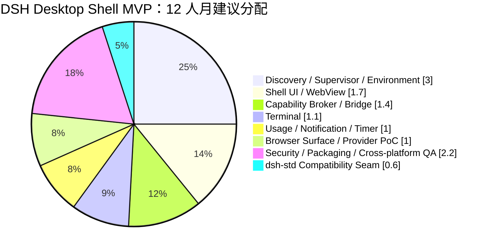
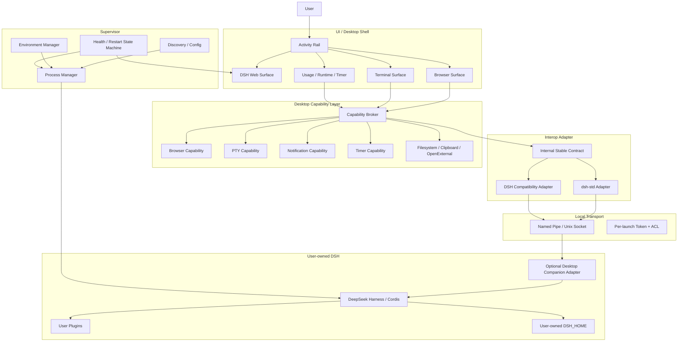
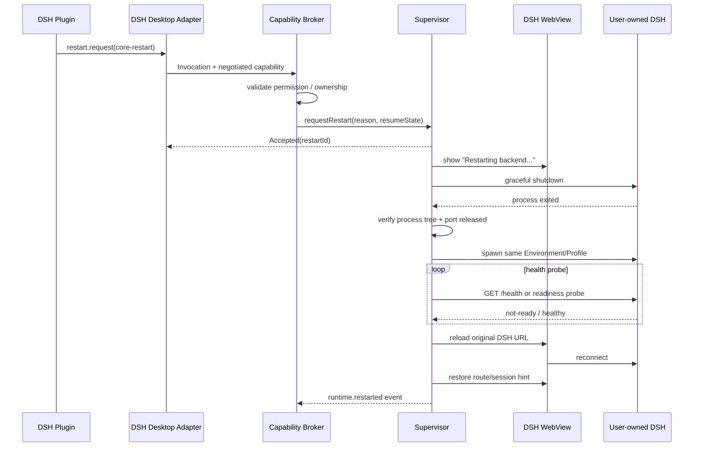
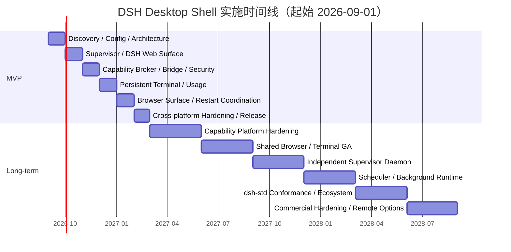

# DSH Desktop Shell：概念架构与可行性调研报告

## 执行摘要

**结论：建议立项，技术上可行，且“用户已有 DSH / 用户自有 `.dsh`”应当成为项目的首要架构原则。**

本项目不应被定义为另一个 DeepSeek Harness 发行版，而应定义为一个独立、稳定、可替换的 **Desktop Control Plane / Workbench Shell**：它发现并连接用户已经安装的 DeepSeek Harness，负责桌面窗口、进程监督、浏览器、终端、通知、计时器等 OS/Native 能力，而 Agent、Session、模型、插件生态和 DSH Web UI 继续属于用户自己的 Harness。DeepSeek 官方当前仍将 Harness 标记为 Developer Preview，并明确提示会发生兼容性破坏；同时 `dsh web` 已天然提供本地 Web UI，默认监听 `127.0.0.1:3080`。这恰好支持“稳定外壳 + 快速变化内核”的分层，而不是继续把 Desktop 与某个固定 DSH 版本绑定。citeturn16view0

核心建议可以压缩为：

> **Desktop Shell 不拥有 DSH；Desktop Shell 监督 DSH。**  
> **Desktop Shell 不重写 DSH UI；Desktop Shell 承载 DSH UI。**  
> **Desktop Shell 不发明第二个插件生态；Desktop Shell 提供可选的 Native Capabilities。**  
> **Desktop Shell 不立即依赖 dsh-std；但从第一天就按照 dsh-std 的 capability negotiation、独立 `apiVersion`、facet、adapter 思路设计边界。**

这与当前社区 `deepseek-harness-desktop` 的主要差异在于，后者承担了运行时下载、Harness Core 管理、Profile 和插件管理等发行职责；它虽然会优先使用已有 `dsh`，但仍能够下载并维护自己的 Node/Harness runtime。我们建议的新项目刻意放弃这部分职责，从而显著减少对上游版本、依赖闭包和插件供应链的耦合。citeturn16view5turn17view0

从“**工程复杂度 / Agent 集成性价比**”看，项目存在一个很明显的甜点区：

| 判断 | 结论 |
|---|---|
| 外部 DSH Discovery / Config | **低成本、极高价值** |
| Supervisor / 自动重启 | **中高成本、核心价值，必须 P0** |
| 原版 DSH Web UI 嵌入 | **低中成本、极高价值** |
| Native Notifications | **低成本、高价值** |
| Usage Dashboard | **中成本、高价值** |
| Persistent Terminal | **中高成本、极高价值** |
| Shared Browser | **高成本、极高潜在价值，适合 P1** |
| Desktop Capability Broker | **中高成本，但决定长期架构质量，必须尽早做小而稳定** |
| 完整 Hot-plugin Runtime | **高成本、高上游耦合，不适合首版** |
| Agent Scheduler / 后台唤醒 | **中高成本，适合长期 Supervisor daemon** |
| dsh-std hard dependency | **目前不推荐** |
| dsh-std compatibility adapter | **强烈推荐** |

当前 `dsh-std` 对我们的方向非常有价值：它明确将自己定位成插件、后台 runtime、Web/TUI/Desktop/headless daemon 之间的通用互操作协议；领域协议独立版本化，参考 npm package 也并非合规实现的必需依赖。与此同时，其提案状态页显示 Core、Manifest、Connection 仍是“方向已确认、接口/格式草案”，多数领域协议、Lifecycle、Permission 等仍是草案或探索性草案。**因此“设计兼容、运行不依赖”是当前风险最低的策略。** citeturn16view1turn16view2

在技术栈上，如果项目目标仅是一个极轻量 DSH wrapper，Tauri 2 很有吸引力；但如果目标确实包括我们讨论的 **Shared Browser + Persistent PTY + Agent/Desktop Bridge + 多 Web Surface**，本报告更推荐 **Electron + TypeScript/Node 作为首个 MVP 实现**。原因不是 Electron 更“先进”，而是工程收敛速度：Electron 当前有官方 `WebContentsView`，DSH 社区的 `dsh-browser` 已经把宿主接缝明确设计为 `ElectronBrowserViewHost → WebContentsView + CDP`；DSH terminal 实现也普遍建立在 Node/PTY/xterm 体系上。Electron 还能把 crash-prone/native service 放入 utility process。Tauri 2 则应保留为后续可替换 Shell Provider，因为它拥有优秀的按 WebView capability/permission 划分机制。citeturn17view3turn20view1turn19search0turn18view2

**六个月、两名全职工程师可以交付 MVP，但前提是主动控制范围。** 首版应把 12 人月容量主要用于 Discovery、Supervisor、WebView、Environment、最小 Desktop Protocol、Terminal、Usage、Notifications、安全与三平台 QA；Browser 首版做到独立嵌入式 Surface 和 Provider seam，Agent 全自动浏览器能力可以作为 P1 beta；完整 Hot-plugin、长期 Scheduler daemon、Remote、完整 dsh-std Connection/Wire 均延后。

MVP 的建议 12 人月分配如下：



这不是“把网页包装成 exe”的项目。**用户看到的是一个带少量 Activity Rail 的专用浏览器；真正的产品价值则在浏览器后面的 Supervisor、Capability Broker 和可替换互操作层。**

## 目标、范围与可行性边界

**项目目标**可以正式定义为：

> **DSH Desktop Shell 是面向 DeepSeek Harness 的跨平台本地工作台和能力宿主。它连接用户拥有的 DSH Runtime 和 DSH_HOME，在不 fork Harness、不拥有 Harness 生命周期版本的前提下，提供稳定的桌面窗口、Runtime Supervisor、Native Capability、Local Interop 与工作环境管理。**

DeepSeek 官方的运行模式天然适配这一目标。DSH 可以从 npm 或源码 checkout 运行，`dsh web` 启动本地 Web UI；源码方式也只是 build 后执行 `pnpm dsh web`。因此 Shell 无需链接 Harness 内部模块即可完成最基本的启动、健康检查和 UI 承载。citeturn16view0

**首要范围包括：**

| 属于 Desktop Shell | 归属理由 |
|---|---|
| DSH discovery / validation | 连接用户已有 Runtime |
| `.dsh` / `DSH_HOME` / Profile / Environment 选择 | 环境引用，不拥有数据 |
| Managed / Attached 运行模式 | 定义生命周期 ownership |
| DSH process supervisor | start / stop / restart / crash recovery |
| DSH WebView | 原版 UI 的主要 Surface |
| Desktop Activity Rail | Browser / Terminal / Usage / Timer / Runtime |
| Browser Surface | OS/Desktop 能力 |
| PTY / Terminal | 应独立于 DSH restart 生命周期 |
| Native notifications | 系统 presentation capability |
| Desktop Capability Broker | Native 能力统一授权与路由 |
| Local IPC / transport | Desktop 与 DSH adapter 间的稳定边界 |
| 最小协议和 dsh-std adapter | 避免 Desktop 私有 ABI 扩散 |
| 安全策略 / capability scopes | Desktop 承担的信任边界 |

**明确不包含：**

| 不包含项 | 原因 |
|---|---|
| **不打包 Harness** | 避免 Core 版本和依赖闭包责任 |
| **不下载/私自安装 Node** | 用户 Runtime 由用户管理 |
| **不 fork upstream Web UI** | 最大限度保持上游兼容 |
| **不进行 DOM monkey-patch 作为正式 API** | 上游 UI 快速变化，兼容成本高 |
| **不复制一个 Desktop Plugin Market** | `dsh-market` 已处理搜索、安装、升级、启停、诊断等，继续让 DSH 拥有插件管理语义更合理。citeturn20view0 |
| **不默认安装 Desktop companion plugin** | Desktop enhancement 必须是 optional |
| **不把普通 DSH plugin 强制变成 Desktop plugin** | 普通插件应完全不知道 Desktop 存在 |
| **不承诺所有插件都可 hot reload** | 官方当前 Bundle membership 在运行中不会自动替换，新增/删除/升级 Bundle 有明确的 restart boundary。citeturn15view1 |
| **不默认开放 LAN** | DSH 的本地工具能力具有高权限；社区打包项目也明确把 `0.0.0.0` 暴露描述为 RCE surface 风险。citeturn17view0 |
| **不在 MVP 做远程 daemon / cloud relay** | 会把身份认证、网络攻击面和后台服务生命周期一次性引入首版 |

一个特别重要的产品概念是区分 **Managed** 与 **Attached**：

```text
Managed
Desktop ──spawn──► DSH
Desktop owns PID/process tree
Desktop may stop/restart/recover DSH

Attached
Desktop ──connect──► Existing DSH
Desktop does NOT own PID
Desktop must NOT kill/restart it without explicit handover
```

这比“发现 3080 端口以后直接接管”安全得多。`openma-ai/deepseek-harness-acp` 已经提供了一个很有价值的 discovery 参考：它依次支持显式 `--dsh-path`、`DSH_PATH`、本地 `node_modules`、PATH 中的 `dsh`、全局 npm 等来源，并且让真实 `$DSH_HOME` Profile 继续拥有 composition。我们建议**借鉴其 discovery 策略，但去掉它最后的 private runtime fallback**，因为 Desktop Shell 的产品原则正是“不拥有备用 Harness”。citeturn17view2

因此 Environment 应成为一等对象，而不仅是一对路径：

```yaml
id: dev
displayName: Dev Harness

runtime:
  mode: managed
  dshPath: D:\repos\deepseek-harness
  command: pnpm
  args: ["dsh", "web", "--no-open"]

home:
  dshHome: C:\Users\alice\.dsh-dev
  profile: web

network:
  host: 127.0.0.1
  port: auto

policy:
  autoRestartOnCrash: true
  allowNativeBridge: true
```

一个 Desktop 可以因此引用：

```text
Stable  ──► system dsh        ──► ~/.dsh
Dev     ──► git checkout      ──► ~/.dsh-dev
Test    ──► another dsh       ──► ~/.dsh-test
```

Shell 自己不需要知道这些 Harness 的具体内部版本实现。官方明确警告 DSH 当前会有 breaking changes，这种 ownership separation 是降低长期耦合的主要手段。citeturn16view0

**技术栈总体判断**如下。这里的评分是本报告的工程判断，而不是上游承诺。

| 路线 | MVP 工程成本 | Shared Browser | PTY | Supervisor | 安全控制 | 对 DSH/插件开发友好度 | 建议 |
|---|---:|---:|---:|---:|---:|---:|---|
| **Electron + Node/TS** | **最低** | **最佳现成参考** | **最佳** | 高 | 中高，需严格隔离 | **最高** | **MVP 首选** |
| Tauri 2 + Rust | 中 | 中高，但需新 provider | 高 | **最佳** | **高** | 中 | 长期优秀候选 |
| Go + Qt | 高 | 高 | 中高 | 高 | 高 | 低中 | 不建议 2 人 MVP |
| Pure Web + sidecar | 低→中 | 低 | 中 | 高 | 中 | 中 | Headless/Remote Surface 合适，不适合作为最终 Workbench |

Tauri 2 使用系统 WebView，并且可以对不同 window/webview 分配不同 capabilities 和 command scopes；这很适合做高质量 native shell。citeturn18view2turn18view3turn19search3 但本项目的关键不是安装包最小，而是 **Agent Browser/Terminal 的实现性价比**。`wqty123/dsh-browser` 当前已经把 browser architecture 拆成 `ctx.browser seam → browser-electron provider → ElectronBrowserViewHost → WebContentsView/CDP`，宿主只需实现 view host；没有桌面外壳时它还可自行启动 Electron。这个现成 seam 大幅改变了技术选型的成本函数。citeturn17view3

因此推荐：

> **MVP：Electron + TypeScript/React + Node Supervisor process。**  
> **长期：Capability/Protocol 层保持 shell-neutral，使 Tauri/Rust provider 可以后来加入，而无需改变 DSH 插件协议。**

## 概念架构与最小稳定协议

建议的正式分层如下：



这里最值得坚持的一条规则是：

> **Native capability 不直接暴露给 DSH WebView。**

DSH 的 Web client 可以加载社区插件，而插件是高变化、高信任差异的代码。Electron 官方建议通过 context isolation / contextBridge 限制 renderer 与 privileged main process 的边界，并可以用 utility process 承载独立服务；Tauri 同样把 capabilities/permissions 作为 WebView 到 native command 的安全边界。citeturn20view1turn18view2turn18view3

因此不要设计：

```javascript
// 不推荐
window.desktop.shell.exec(...)
window.desktop.fs.read(...)
window.desktop.browser.cdp(...)
```

即便 technically easy，也不应把这种 privileged object 注入整个 upstream DSH renderer。

更安全的结构是：

```text
DSH host-side companion adapter
              │
         authenticated IPC
              │
       Capability Broker
              │
      policy / permission
              │
          OS capability
```

也就是说，**语义跨进程，权限不跨信任边界。**

dsh-std 的 Connection 提案与这个结构非常契合：其设计明确把 endpoint negotiation 与 carrier/transport 分开，并把端口、认证材料、重连、carrier supervision、process ownership 等责任交给 Connection Host，而不是每个应用自己重复管理；当前提案状态仍为“方向已确认、接口草案”，日期为 2026 年 8 月 17 日。citeturn16view3

**本项目最小协议应当“像 dsh-std”，但暂不等同于 dsh-std。**

建议第一版只定义四类消息：

```text
HELLO / NEGOTIATE
INVOKE
RESULT
EVENT
```

协议不包含：

```text
Agent
Session
Model
Plugin Market
Storage format
DSH internal objects
```

这些继续由 DSH 自己拥有。

一个最小 envelope 的 JSON Schema 可设计为：

```json
{
  "$schema": "https://json-schema.org/draft/2020-12/schema",
  "$id": "urn:dsh-desktop:protocol:envelope:v1alpha1",
  "type": "object",
  "required": [
    "apiVersion",
    "kind",
    "id",
    "participant",
    "timestamp",
    "payload"
  ],
  "properties": {
    "apiVersion": {
      "type": "string",
      "pattern": "^[a-z0-9.-]+/v[0-9]+(alpha[0-9]+|beta[0-9]+)?$"
    },
    "kind": {
      "enum": [
        "Hello",
        "Agreement",
        "Invocation",
        "Result",
        "Event"
      ]
    },
    "id": {
      "type": "string",
      "minLength": 8
    },
    "participant": {
      "type": "object",
      "required": ["component", "facet"],
      "properties": {
        "component": {
          "type": "string"
        },
        "facet": {
          "type": "string"
        },
        "activationId": {
          "type": "string"
        }
      },
      "additionalProperties": false
    },
    "timestamp": {
      "type": "string",
      "format": "date-time"
    },
    "payload": {
      "type": "object"
    }
  },
  "additionalProperties": false
}
```

Negotiation 示例：

```json
{
  "apiVersion": "interop.dsh-desktop/v1alpha1",
  "kind": "Hello",
  "id": "hello-8b093e24",
  "participant": {
    "component": "dsh-desktop-shell",
    "facet": "desktop",
    "activationId": "desktop-20260825-a1"
  },
  "timestamp": "2026-08-25T10:00:00Z",
  "payload": {
    "supports": [
      {
        "apiVersion": "runtime.dsh-desktop/v1alpha1",
        "kind": "RuntimeControl"
      },
      {
        "apiVersion": "terminal.dsh-desktop/v1alpha1",
        "kind": "Terminal"
      },
      {
        "apiVersion": "browser.dsh-desktop/v1alpha1",
        "kind": "Browser"
      },
      {
        "apiVersion": "notification.dsh-desktop/v1alpha1",
        "kind": "Notification"
      }
    ],
    "requires": []
  }
}
```

这直接借鉴了 dsh-std 最重要的几个思想：`apiVersion + kind` 的协议身份、requires/supports 协商、领域协议独立演进、Component→Facet→Activation→Participant。dsh-std 同时明确表示 reference package 不是标准本身，实现者无需依赖其 npm packages；这给我们的“兼容但不硬依赖”策略提供了很强的设计依据。citeturn16view1turn16view4

Runtime restart invocation 可以是：

```json
{
  "apiVersion": "runtime.dsh-desktop/v1alpha1",
  "kind": "Invocation",
  "id": "invoke-50b57ec1",
  "participant": {
    "component": "plugin.example",
    "facet": "host",
    "activationId": "plugin-a82d"
  },
  "timestamp": "2026-08-25T10:04:18Z",
  "payload": {
    "method": "restart.request",
    "params": {
      "policy": "core-restart",
      "reason": "plugin-update",
      "message": "Updated host bundle requires restart",
      "resume": {
        "sessionId": "session-abc",
        "route": "/session/session-abc"
      }
    }
  }
}
```

建议定义的 restart policy：

```text
none
client-reload
plugin-reload
core-restart
runtime-restart
```

其中：

- `client-reload`：只刷新 DSH Web Surface；
- `plugin-reload`：如果当前 DSH adapter 明确支持安全 HMR 才使用；
- `core-restart`：退出并重新启动同一个 DSH；
- `runtime-restart`：连 Runtime/sidecar 一并重启，首版极少使用。

这个区分符合现实情况。DeepSeek 官方目前明确区分了 Bundle membership 的 restart boundary 与普通 Profile/Patch 的 hot reload；社区 `dsh-hot-reload` 则进一步证明 node_modules 插件可以尝试做 in-process swap 和 failure rollback，但它本质上是在补充当前 HMR 对已安装 package 的空缺，不能当成上游稳定保证。citeturn15view1turn15view14

典型的插件请求 restart 流程：



需要注意：`Accepted` 必须在旧 DSH process 退出前返回；不能指望被重启的插件进程在 shutdown 之后继续等待同一个 RPC response。

**向 dsh-std 的替换路线**应分阶段进行：

| 阶段 | 实现 |
|---|---|
| 初期 | 自有 typed envelope + local socket，字段语义对齐 dsh-std |
| dsh-std Core 稳定后 | `Interop Adapter` 使用/兼容其 Core negotiation fixtures |
| Connection 稳定后 | 把 endpoint/agreement 映射到 `@dsh-std/connection` |
| Browser/Terminal 等领域出现稳定协议后 | 一个 capability 一个 adapter，不改变 Broker 内部 API |
| Wire profile 和 conformance 成熟后 | 增加标准 wire provider，与 legacy transport 并存 |
| 至少两个稳定兼容周期后 | 才讨论淘汰私有 legacy adapter |

社区 RFC 也明确提出：上游变化应收敛到版本化 Adapter；capability 声明不是沙箱；参考实现不是标准。这三条尤其适合成为本项目的架构约束。citeturn16view4

## 模块工程复杂度与 Agent 实现性价比

以下估算按 **1 人月≈1 名工程师一个月全职投入**理解。区间包含模块开发、单测和基本集成，不包含全部产品级三平台回归、签名/公证、发布文档和最终安全审计。两个工程师六个月的名义容量为 **12 人月**，实际不能把 12 人月全部填满 feature work，否则没有 integration buffer。

为了压缩技术栈描述，下面采用：

- **E/N**：Electron + Node.js/TypeScript；
- **T/R**：Tauri 2 + Rust；
- **G/Q**：Go Supervisor + Qt/C++/QML Surface；
- **W/S**：普通 Web UI + Node/Go/Rust sidecar。

“Agent 集成难度”指 **让 DSH Agent 实际消费这个 capability 所需的 plugin/bridge 改造量**，不是单纯 UI 实现难度。

| 模块 | 功能与技术栈选择 | 复杂度 / 独立估算 | Agent 集成难度 / 性价比 | 主要风险与缓解 |
|---|---|---|---|---|
| **Discovery / Config** | 发现 PATH/global/source checkout/显式 path，验证 `DSH_HOME`、profile、version、launch recipe。E/N/T/R/G/Q/W/S 都简单 | **低，0.3–0.6 PM** | **低 / 极高**；无需插件 | 路径/Node/pnpm 模式繁多；保存 resolved launch plan，并做 dry-run validation。ACP 已提供优秀 discovery 顺序参考。citeturn17view2 |
| **Supervisor / Process Manager** | managed/attached、spawn、graceful stop、crash recovery、readiness、process tree。E/N 方便；T/R 最适合长期 daemon；G/Q 也强 | **高，1.4–2.2 PM** | **中 / 极高**；只需 restart companion | Windows orphan tree、端口未释放、double-start。Windows 使用 Job Object 管理子进程树；Unix 使用 process group/session；先 graceful 后 force kill。Windows Job Object 原生支持关联子进程和终止 job 中的进程。citeturn18view6 |
| **WebView Embedding** | 承载原版 `dsh web`，overlay/loading/reconnect/route restore。E/N 用 renderer/WebContentsView；T/R 用 system WebView | **中，0.7–1.2 PM** | **低 / 极高**；无插件即可 | 上游页面初始化、认证/插件加载失败、WebView 差异。禁止 DOM patch；只做外层状态。 |
| **Desktop Capability Broker** | Native capability registry、grant、scope、ownership、audit、invocation routing | **高，1.0–1.6 PM** | **中 / 极高**；所有 native-aware plugin 共用一次 bridge | Broker 变成“万能 RPC”。严格按 capability 拆 namespace，deny-by-default，资源句柄必须归属 activation。dsh 社区 RFC 也强调 Broker 与 effect ownership。citeturn16view4 |
| **Browser WebView** | 人类与 Agent 共享真实页面、多 tab/session、cookies。**E/N 明显最省成本**；T/R 要写不同 browser provider；G/Q 需 Qt WebEngine adapter | **高，1.4–2.4 PM** | **高 / 高—极高**；需要 browser provider + Agent tools | 登录态、下载、popup、恶意页面、Agent误操作。独立 Browser session、禁止 Node integration、默认 HTTP(S)、动作白名单与用户接管。`dsh-browser` 已验证 seam/provider/tool 三层和 action guard。citeturn17view3 |
| **Native Terminal / PTY** | Supervisor-owned PTY + xterm；E/N + node-pty 最直接；T/R 使用 native PTY abstraction；W/S 仍需要 sidecar | **高，1.0–1.8 PM** | **中 / 极高**；人类 terminal 无插件，Agent terminal 需要受控 tool bridge | 任意 shell 等于高权限代码执行；Agent access 必须单独授权。社区 terminal 当前 PTY 随 Harness restart 消失，正说明迁移到 Supervisor 生命周期有价值。citeturn17view1 |
| **Desktop Bridge API** | negotiation、invocation/result/event、resource handle、restart policy。所有栈都可 | **中，0.8–1.3 PM** | **中 / 极高**；需要一个 tiny host companion adapter | 私有 ABI 无限膨胀。限制为 OS/Desktop capabilities，Agent/Session/Model 不进入 Bridge；使用版本化 capability。 |
| **Usage Collector** | DSH-side 捕获 provider/runtime usage → normalized projection → Desktop dashboard。E/N/T/R UI 均简单 | **中，0.6–1.0 PM** | **中 / 高**；需要 usage projection/adapter | 直接解析内部 log 易随 upstream 变化。应让 DSH plugin 提供语义化聚合。现有 usage plugin 已实现 provider/runtime usage、去重、本地持久化和恢复，可优先复用模式。citeturn15view13 |
| **Timer / Scheduler** | Desktop Timer 可完全 native；Agent Scheduler 应留在 DSH，Supervisor 后期只负责 wake-up | **Timer 低 0.2–0.4；完整 Scheduler 中高 0.8–1.3 PM** | **Timer 低 / 高；Scheduler 中高 / 中高** | 把普通计时器和 Agent automation 混为一谈。社区 scheduled-tasks 已采用 fresh headless Agent session + durable history，可直接借鉴语义。citeturn15view15 |
| **Notifications** | DSH semantic event → Desktop native notification。四种路线都简单 | **低，0.2–0.4 PM** | **低 / 极高**；小型 projection adapter | 重复通知、泄露敏感正文。需 visibility gate、去重和 content policy。现有 dsh-notification 的 host projection/client decision 模型值得复用。citeturn15view16 |
| **Hot-plugin 协调** | 接收 restart policy、client reload、可选 plugin reload；不自己重做完整 module loader | **高，0.8–1.4 PM** | **高 / 中高** | client/host 版本 split-brain、Node cache、插件初始化失败。MVP 只协调官方 restart boundary；完整 HMR P2。官方对 Bundle 更改要求 restart，社区 HMR 可作为实验 provider。citeturn15view1turn15view14 |
| **Profile / Environment 管理** | core path + DSH_HOME + profile + port + launch args + attach/managed ownership | **中，0.5–0.9 PM** | **低 / 极高**；不需要 plugin | Shell 误写用户 `.dsh`。Desktop 配置只保存 reference；所有 destructive operation 显式确认。 |
| **Security / Supply-chain Control** | permission scopes、IPC auth、WebView isolation、plugin/build-script warning、audit log | **高，1.0–1.6 PM** | **低 / 极高**；不以 Agent 功能体现，却是发布前提 | 任意 shell/browser/plugin 扩展攻击面。deny by default、socket ACL、per-launch token、no LAN、no renderer native bridge、显式 build allowlist。Tauri/Electron 都有可用隔离机制。citeturn18view2turn20view1 |
| **dsh-std Compatibility Adapter** | internal contract ↔ Core/Connection/domain protocols；feature flag，可选 npm dependency | **中高，0.6–1.2 PM** | **中 / 长期极高** | 标准正在快速变化。Internal API 固定，Adapter 独立 package；不让 std type 泄漏到核心业务代码。当前大量协议仍处草案阶段。citeturn16view2 |

这里有三个需要特别强调的工程结论。

**第一，Supervisor 是整个项目最值得花人月的模块。**

现有插件已经不断“在插件里重新发明 Supervisor”。DSH 官方要求某些 Bundle 改动 restart；terminal 的 PTY 当前无法跨 Harness restart 存活；plugin market 也需要在无法 hot-load 时给出 restart 操作。citeturn15view1turn17view1turn20view0

如果 PTY、Browser host 和 Shell 自身都在 DSH 外：

```text
Desktop/Supervisor
 ├── PTY A ───────────────────────────── alive
 ├── Browser Session ─────────────────── alive
 │
 └── DSH
       ↓ restart
     DSH
```

那么一次 DSH Core restart 不再意味着整个用户工作台一起消失。

**第二，Browser 是高复杂度，但 Agent 性价比可能是全项目最高的 P1。**

`dsh-browser` 已经证明了“用户和 Agent 操作同一个真实可见页面”的模式，并把 browser seam、Electron provider 和 Agent tools 分开；它还实现了任务级浏览器会话隔离、登录态、action whitelist 等关键语义。citeturn15view10turn17view3

Desktop Shell 因此不必自己重新设计整个 Agent browser API。最合适的做法是：

```text
Desktop Browser Surface
        │
ElectronBrowserViewHost-compatible provider
        │
existing / adapted browser seam
        │
DSH browser_* tools
```

Electron 目前官方推荐使用 `WebContentsView` 承载额外 web content；旧 `BrowserView` 已被弃用。citeturn19search0turn19search6

**第三，Terminal 应当把“Human PTY”和“Agent Shell Tool”视为两种能力。**

用户手动打开：

```text
Terminal → PowerShell/bash/zsh
```

不应自动意味着：

```text
Agent → unrestricted terminal
```

后者必须单独协商：

```text
terminal.interactive       // human
terminal.agent.execute     // agent, privileged
```

这是一条重要的安全边界。社区 terminal 实现的 PTY/xterm/WebSocket 模式可以直接参考，但其“session process-local，Harness restart 后消失”正是我们应通过 Supervisor-owned PTY 改进的地方。citeturn17view1

从 AI Coding Agent 辅助开发的角度，本项目也有比较好的结构性条件：Discovery、配置 schema、typed protocol、UI、adapter、状态机测试都非常适合通过明确接口让 Coding Agent 分模块实现；真正需要高级人工审查的部分主要集中在 Windows/Unix process ownership、PTY、Browser privilege boundary、IPC authentication 和 release security。也就是说，应当让 Agent 多写“可测试的 adapter 和纯函数”，少让 Agent 自由设计“隐式权限和跨进程生命周期”。

## 优先级矩阵与实施路线

以下评分均为 **1–5**：

- 用户价值：5 = 极高；
- 实现难度：5 = 很难；
- 上游耦合：5 = 强依赖 DSH 内部变化；
- 安全风险：5 = capability 本身引入高风险；
- 维护成本：5 = 长期成本高。

P0 代表 MVP 基础边界；P1 代表 MVP 后半或紧随 MVP；P2 代表不应成为首版 release blocker。

| 模块 | 用户价值 | 实现难度 | 上游耦合 | 安全风险 | 维护成本 | 推荐 |
|---|---:|---:|---:|---:|---:|---|
| Discovery / Config | 5 | 1 | 2 | 2 | 1 | **P0** |
| Supervisor / Process Manager | 5 | 4 | 2 | 4 | 3 | **P0** |
| WebView Embedding | 5 | 2 | 2 | 3 | 2 | **P0** |
| Profile / Environment | 5 | 2 | 2 | 2 | 2 | **P0** |
| Desktop Capability Broker | 5 | 4 | 1 | 4 | 3 | **P0** |
| Minimal Desktop Bridge API | 5 | 3 | 2 | 4 | 3 | **P0** |
| Security / Supply-chain | 5 | 4 | 1 | 1* | 4 | **P0** |
| Notifications | 4 | 1 | 2 | 1 | 1 | **P1 / MVP** |
| Usage Collector | 4 | 3 | 3 | 2 | 3 | **P1 / MVP** |
| Native Terminal / PTY | 5 | 4 | 1 | 5 | 4 | **P1 / MVP** |
| Browser WebView | 5 | 5 | 2 | 5 | 5 | **P1** |
| dsh-std Adapter | 4 | 3 | 3 | 2 | 4 | **P1** |
| Timer / Agent Scheduler | 3–4 | 3 | 3 | 3 | 3 | **Timer P1 / Scheduler P2** |
| Hot-plugin Runtime | 4 | 5 | 5 | 4 | 5 | **P2** |

\* Security/Supply-chain 行的“1”代表该模块自身不增加权限，而是降低整体风险；它仍然是 P0。

**MVP 路线：六个月、两人、12 人月名义容量**

这一路线的原则是：**先做稳定外壳，再做丰富能力；Browser 自动化和完整 Hot-plugin 不作为 GA 阻断条件。**

| 里程碑 | 估算 | 主要交付物 | 验收标准 | 关键依赖 |
|---|---:|---|---|---|
| **基础定义与 Discovery** | 1.5 PM | Electron shell、config schema、Environment model、PATH/source/global discovery | 能指定 Core 与 `.dsh`；能验证可启动但不修改用户环境；错误可诊断 | DSH CLI 行为 |
| **Supervisor 与 DSH Surface** | 2.0 PM | Managed/Attached、process ownership、health、restart state machine、DSH WebView | Managed 可可靠 restart；Attached 不杀外部 PID；异常退出有明确状态；UI 不随 DSH restart 退出 | OS process APIs |
| **Capability/Bridge 基线** | 2.0 PM | Local IPC、per-launch auth、Broker、协议 negotiation、Environment switching、native notification | 无 privileged API 直接注入 DSH renderer；未知 capability 被拒；协议版本可协商 | companion adapter |
| **Persistent Terminal 与 Usage** | 2.0 PM | Supervisor-owned PTY、xterm surface、usage projection/dashboard | DSH restart 后用户 PTY 保持；usage 不因 WebView reload 丢失；Agent PTY 权限默认关闭 | node-pty / usage adapter |
| **Browser Surface 与 Restart Coordination** | 2.0 PM | WebContentsView browser、人类 tab/session、browser provider seam、restart policy | 三平台基本浏览；DSH restart 不关闭 browser；Agent provider 至少完成 reference PoC，自动化可为 beta | Electron browser provider |
| **商业发行前硬化** | 2.5 PM | Win/macOS/Linux packaging、security review、crash tests、std adapter experimental、docs | 三平台启动/连接/restart smoke suite；无 LAN 默认暴露；无 auto-allow build script；升级不破坏用户 `.dsh` | CI runners、签名环境 |

合计 **12 PM**。这已经很紧，因此完整 Scheduler、Remote、Hot plugin module replacement、不应塞进首版。

时间线建议：



**长期路线：十八个月、四人**

如果把它作为一条独立路线计算，团队理论总容量是 **72 人月**。如果实际情况是先按两人做完前述 6 个月 MVP，再从第 7 个月扩成四人，则整个十八个月的实际总容量约为 **60 人月**；两种预算模型不能混用。

按独立 4 人路线，建议：

| 阶段 | 人月预算 | 交付物 | 验收标准 |
|---|---:|---|---|
| Foundation | 10 PM | Shell、Discovery、Environment、Supervisor、协议、自动化测试基座 | 可稳定连接多种用户-owned DSH |
| Cross-platform GA | 12 PM | 三平台 Web/PTY/Usage/Notifications、安全策略、installer | 三平台升级、崩溃、restart 回归通过 |
| Capability Workbench | 13 PM | Shared Browser GA、多 Browser sessions、PTY workspace、activity rail extension | Browser/Terminal 生命周期与 DSH 解耦，权限可审计 |
| Supervisor Daemon | 13 PM | UI 与 Supervisor 真正独立、后台 jobs、wake-up、health/recovery | Desktop UI 重启不影响 DSH/PTY；DSH restart 不影响 Shell resources |
| Standards & Ecosystem | 12 PM | dsh-std conformance、adapter matrix、third-party capability providers | 至少两类独立 client/provider 通过一致性 fixtures |
| Commercial Hardening | 12 PM | SBOM、dependency policy、签名更新、权限 UX、remote opt-in、长期兼容测试 | 可审计发布链；默认无网络暴露；安全升级不覆盖用户数据 |

长期路线真正值得投入的不是增加几十个 sidebar icon，而是建立：

```text
DSH Desktop
    ↓
Capability Broker
    ↓
multiple providers

Browser:
  Electron provider
  Future Tauri provider
  Remote browser provider

Terminal:
  Local PTY provider
  SSH provider

Runtime:
  Local DSH provider
  Future remote provider
```

一旦这一层形成，Desktop Shell 就从“一个 app”变成了 **DSH 的桌面 capability host**。

## 开源复用、安全与许可审计

公开生态已经存在足够多的“局部验证”，这显著降低了项目的技术未知数。需要注意的是：**参考架构和直接复制代码是两回事**，尤其商业发行必须逐仓库、逐 pinned commit 做许可审计。

| 参考项目 | 已验证的关键点 | 本项目建议如何复用 |
|---|---|---|
| **DeepSeek Harness 官方** | `dsh web` 本地运行、Everything is Plugin、Profile/Bundle、明确 Developer Preview；Bundle membership 与 hot reload 有不同 restart boundary。citeturn16view0turn15view1 | **行为真源**。不复制 UI，不 import 私有 runtime；所有兼容测试围绕公开 CLI/Web/adapter 能力 |
| **dsh-std** | meta-protocol、独立 `apiVersion`、requires/supports negotiation、实现无需依赖 reference npm packages。citeturn16view1 | 直接采用概念模型；MVP adapter 可选，不作为 core dependency |
| **dsh-std Connection Proposal** | Endpoint/Agreement 与 carrier 分离；Connection Host 管理 transport、credentials、reconnect、process ownership。citeturn16view3 | Desktop Supervisor/Broker 直接按照 Connection Host 的职责边界组织 |
| **Community Interop RFC v0.15** | Adapter 吸收 upstream churn、capability ≠ sandbox、Broker/effect ownership、reference implementation ≠ standard。citeturn16view4 | 转化为项目 architecture rules；但不能称为 DeepSeek 官方标准 |
| **deepseek-harness-desktop** | Tauri shell、core/profile/plugin/lifecycle 已证明 Desktop control plane 可行；也支持检测已有 `dsh`。citeturn16view5 | **参考 lifecycle/UI 组织，不建议商业项目直接复制代码**，原因见其额外许可条款 |
| **deepseek-harness-pkg** | 自动同步 upstream、跨平台 bundle、patch 管理、build-script 供应链问题。citeturn17view0 | 主要当“为什么不打包 Core”的反例/经验库；复用 CI 思路，不采用 `dangerouslyAllowAllBuilds` |
| **openma-ai/deepseek-harness-acp** | 外部 DSH discovery、共享 `$DSH_HOME`、transport-independent host surface、capability negotiation extension。citeturn17view2 | **Discovery 与 Adapter 优先参考源码之一**；删除 private runtime fallback |
| **wqty123/dsh-browser** | Shared visible browser、session isolation、Electron view-host seam、provider/tool 分层、action restrictions。citeturn17view3 | **Browser 模块最高优先参考实现**；尽量适配其 seam，而非重写 browser tools |
| **omdsh-dev/DSH-better-sidebar** | Workspace/terminal/Git/browser 等 Workbench UI；第三方与内置 tab 走同一 service API。citeturn15view12 | 借鉴 Activity/Tab service 思想；**不要把整个 sidebar 搬到 Desktop**，避免和 DSH UI 职责重叠 |
| **mervyn-teo/dsh-plugin-terminal** | PTY + xterm、host/browser 两半、WebSocket；当前 terminal session 不跨 DSH restart。citeturn17view1 | 复用 xterm/PTY UX 与协议思路；把 PTY ownership 提升到 Supervisor |
| **dsh-token-usage-sidebar** | provider/runtime usage、dedupe、SQLite persistence、history recovery。citeturn15view13 | 优先做 DSH-side collector adapter，Desktop 只消费 normalized metrics |
| **dsh-hot-reload** | 监控 lockfile、插件 live swap、失败 rollback、无法 reload 时要求 restart。citeturn15view14 | 作为 optional hot-plugin provider 参考；**不要成为 Supervisor 核心依赖** |
| **@opendsh/dsh-plugin-scheduled-tasks** | project schedule → fresh headless agent session + durable run history。citeturn15view15 | Scheduler 语义继续留在 DSH；长期 Supervisor 只补 cold-start/wake-up |
| **dsh-notification** | host projection + client decision + browser Notification，不改 Harness。citeturn15view16 | 保留 event semantic，presentation 改为 native Notification provider |
| **dsh-market** | 市场、安装/升级/卸载、hot enable/disable、diagnostics、必要时 restart。citeturn20view0 | **不再造 Desktop Market**；未来只消费其 plugin-state/restart event |

这里尤其需要提醒商业发行的 **license 风险**。

DeepSeek Harness 官方仓库当前是 MIT。citeturn16view0 `dsh-std` 目前也以 MIT 发布。citeturn16view1

但是 `dsh-tauri-desk/deepseek-harness-desktop` 虽然仓库展示 MIT 文件，同时存在 `LICENSE.details`，其中明确增加了 **“No Commercial Secondary Development”** 条款，禁止为了商业收益、报酬或作为付费产品/服务的一部分对该软件进行二次开发，并声明额外条款冲突时优先。citeturn16view7

因此商业项目的正确策略应当是：

```text
Architecture observation            ✔
Black-box behavior comparison       ✔
API / design pattern learning       ✔

Copy source code                    → license review
Derive substantial implementation   → legal review
Ship bundled third-party assets     → dependency-level review
```

尤其不能因为仓库首页显示 “MIT” 就忽略附加许可文件。

**供应链风险**也不应低估。DeepSeek 官方插件参考说明，Git-hosted 源码插件的 `prepare` build script 在 pnpm 新版本下需要消费者显式 allow；这是一个有意存在的安全门槛。citeturn15view1

更值得警惕的是 `deepseek-harness-pkg` 为追求最新上游同步，把：

```text
minimumReleaseAge: 0
dangerouslyAllowAllBuilds: true
```

作为自动构建策略，并且仓库自己明确建议若要提高供应链安全，应恢复为显式 `allowBuilds` allowlist。citeturn17view0

**DSH Desktop Shell 应采取相反策略：**

| 风险 | 建议策略 |
|---|---|
| npm/pnpm build scripts | **默认不自动放行**；显示 package、script、source、hash，让用户或企业 policy allow |
| Desktop 自动安装插件 | MVP **不做**；交给 DSH / dsh-market |
| Core 自动升级 | **不做**；只检测当前用户 Runtime 改变并提示 restart |
| LAN 暴露 | 默认只接受 loopback / local IPC |
| Local IPC | Unix socket 权限 / Windows named-pipe ACL + per-launch随机 token |
| Desktop renderer | 不拥有 Node/native privilege |
| DSH WebView | 不注入 unrestricted Desktop bridge |
| Browser WebView | 独立 session、无 Node integration、禁止任意 `file:` 导航、下载需 policy |
| Agent Browser writes | 动作级 capability/guard，可要求审批；只读 snapshot 与 mutate action 分离 |
| PTY | Human PTY 与 Agent execution 分权 |
| `.dsh` | Desktop 默认只读发现，不替用户迁移/清洗 |
| Credentials | 不经 Browser Surface；不写日志；IPC payload 最小化 |
| Logs | 路径、环境变量、tokens、Authorization headers 必须 redact |
| Updates | Shell update 与 DSH update 完全分离 |

Tauri 的 capabilities 可以精确限定特定 WebView 获得哪些 commands 和 path scopes，且官方特别提醒多个 capability 作用于同一 WebView 时权限会合并；若以后实现 Tauri provider，应利用这个模型，而不是给主窗口一个宽泛的 `shell:* / fs:*` 权限集合。citeturn18view2turn18view3

Electron 版本则应遵循相同原则：DSH Surface 与 Browser Surface 均无 Node integration；privileged main/utility process 通过窄 IPC 接口工作。Electron 官方的 process model 将 context isolation/contextBridge 作为 renderer 与 privileged API 的边界，并提供 utility process 承载 crash-prone 或独立 Node 服务。citeturn20view1

一个推荐的最终 trust map 是：

```text
Highest privilege
┌─────────────────────────────────────────┐
│ Supervisor / Capability Broker          │
│ process / PTY / filesystem / notify     │
└────────────────┬────────────────────────┘
                 │ typed + authenticated IPC
┌────────────────▼────────────────────────┐
│ DSH Host Adapter                        │
│ trusted companion, minimal API          │
└────────────────┬────────────────────────┘
                 │ DSH public semantics
┌────────────────▼────────────────────────┐
│ User-owned DSH + User Plugins           │
└─────────────────────────────────────────┘

Separate trust domain
┌─────────────────────────────────────────┐
│ External Browser WebContents            │
│ NO Node / NO Desktop IPC                │
└─────────────────────────────────────────┘
```

这比把 native API 注入上游页面重要得多。

## 最终推荐与首版产品定义

**是否按照“用户已有 DSH”模型实现：是，而且建议把它写进项目 Charter，作为不可轻易改变的基本原则。**

理由有五个。

**其一，兼容性。** DSH 当前仍处于 Developer Preview，并明确声明会发生 breaking changes。只要 Desktop 不拥有 Harness dependency tree、不 fork UI，绝大多数上游变化只需要落入 launch adapter 或 optional companion adapter，而不需要重新发布一整套 bundled Core。citeturn16view0

**其二，用户环境是真源。** 用户已经拥有模型设置、credentials、profiles、sessions、plugins 和自己的 `.dsh`。ACP 项目已经验证了不同 surface 可以复用同一个 `$DSH_HOME` 和 Host composition，而不需要重新创建第二个产品生态。citeturn17view2

**其三，供应链明显变小。** 不打包 Harness 意味着 Desktop 不需要承担“最新 DSH → 新依赖 → 新 native build script → 新 bundle”的整条自动信任链。现有 pkg 项目已经清楚暴露了这种自动跟新的供应链权衡。citeturn17view0

**其四，生命周期反而更强。** 因为 Shell 与 DSH 不同进程，所以 Harness 升级、插件 restart、崩溃恢复都可以由 Supervisor 在 Shell 不退出的情况下处理。Terminal、Browser 等工作台资源还可以拥有比 DSH 更长的生命周期。

**其五，它使 Desktop 有机会成为一个真正的通用 Surface，而不是某一版 Harness 的发行附件。**

因此项目最终边界应当保持：

```text
              DSH Desktop Shell
                     │
       ┌─────────────┴─────────────┐
       │                           │
Desktop Workbench            Runtime Control
       │                           │
Browser / PTY / Usage          Supervisor
Notify / Timer                   │
       │                         │
       └──────── Capability ──────┘
                  Broker
                    │
               Interop Adapter
                    │
              Local Transport
                    │
          optional DSH adapter
                    │
        ┌───────────▼────────────┐
        │ User-owned DSH         │
        │ User-owned .dsh        │
        │ User-owned plugins     │
        └────────────────────────┘
```

**是否立即依赖 `dsh-std`：否。**

但这不是“忽略 dsh-std”。恰恰相反，建议：

> **协议模型强对齐，package dependency 弱绑定。**

`dsh-std` 已经给出了非常正确的方向：meta-protocol、领域协议独立版本化、capability negotiation、adapter、facet/activation/participant、Connection Host；同时官方状态文档也明确告诉我们很多接口仍是草案。它甚至明确规定实现者无需依赖 reference packages 才能合规。citeturn16view1turn16view2

所以最佳策略是：

```text
Today

Desktop Internal Contract
        │
        ├── legacy DSH adapter
        └── experimental dsh-std adapter

Later

Desktop Internal Contract
        │
        ├── dsh-std stable adapter   ← default
        └── legacy adapter           ← compatibility
```

而不是：

```text
Desktop core imports every @dsh-std/*
            ↓
draft API changes
            ↓
Desktop architecture changes
```

**首版 MVP 最终建议功能清单：**

| 首版能力 | 状态 |
|---|---|
| Windows / macOS / Linux desktop shell | **必须** |
| 用户选择 / 自动发现已有 DSH | **必须** |
| 用户指定 `.dsh` / `DSH_HOME` | **必须** |
| Environment / Profile | **必须** |
| Managed / Attached mode | **必须** |
| Supervisor state machine | **必须** |
| graceful stop / restart / crash recovery | **必须** |
| 原版 DSH Web UI | **必须，零 fork** |
| restart overlay / reconnect / route restore | **必须** |
| 最小 capability negotiation | **必须** |
| authenticated local IPC | **必须** |
| Native notification | **必须** |
| Usage dashboard | **推荐进入 MVP** |
| Supervisor-owned persistent terminal | **推荐进入 MVP** |
| Human embedded browser | **推荐进入 MVP** |
| Agent-controlled shared browser | **P1 beta，不作为 GA blocker** |
| Desktop Timer / Pomodoro | **低成本，可进入 MVP 后段** |
| Full Agent Scheduler | **P2** |
| Full plugin hot reload engine | **P2** |
| Remote access / cloud relay | **P2** |
| Desktop plugin marketplace | **明确不做** |
| Bundled Harness / Node runtime | **明确不做** |
| dsh-std mandatory runtime dependency | **明确不做** |

如果六个月只能把一个方面做到“特别好”，应优先把下面这条链做到非常可靠：

```text
Discover user DSH
      ↓
Validate Environment
      ↓
Spawn / Attach
      ↓
Open original Web UI
      ↓
Monitor
      ↓
Graceful Restart
      ↓
Kill-tree fallback
      ↓
Health Check
      ↓
Reconnect
      ↓
Restore user context
```

因为这条链一旦稳定，后面的 Browser、Terminal、Usage、Notifications、Timer 都只是 **Capability Provider**。

反过来，如果一开始先做一个非常漂亮的 Activity Rail、插件市场和大量 native widget，却没有可靠的 ownership、restart、IPC 和 security boundary，项目就会重新变成另一个难以跟随 DSH 上游变化的 Desktop fork。

最终的 **Go / No-Go** 判断是：

| 决策 | 建议 |
|---|---|
| **创建 DSH Desktop Shell 项目** | **GO** |
| **采用用户已有 DSH / `.dsh`** | **YES，核心原则** |
| **Shell 与 DSH Core 进程隔离** | **YES** |
| **首版即拆独立 Supervisor daemon** | **NO；先独立 process/service boundary，MVP 后再 daemonize** |
| **首选 MVP 技术栈** | **Electron + TypeScript/Node + React** |
| **保留 Tauri Provider 可能性** | **YES** |
| **修改 upstream DSH UI** | **NO** |
| **给 DSH WebView 注入 unrestricted native API** | **NO** |
| **建立 Desktop Capability Broker** | **YES，P0，小而稳定** |
| **Shared Browser** | **YES，P1，高价值** |
| **Persistent PTY** | **YES，P1/MVP** |
| **Usage / Notifications** | **YES，MVP** |
| **完整 Hot-plugin Runtime** | **NO，P2；首版只协调 restart policy** |
| **立即 hard-depend dsh-std** | **NO** |
| **从第一天兼容 dsh-std 概念和 adapter 边界** | **YES** |
| **直接 fork/复制现有 deepseek-harness-desktop 做商业版本** | **NO，先完成许可审计** |

从工程投入与 Agent 实现性价比看，**这个项目最有价值的不是再创造一个 DSH UI，而是创造一个 DSH 可以反复重启、升级和变化，而用户工作环境仍保持稳定的“外层运行空间”**。现有 DSH Desktop、ACP、Browser、Terminal、Usage、Notification、Market、Hot Reload 等项目已经分别验证了这条架构中的大部分局部能力；真正尚未被系统性解决的，是把这些能力统一放进一个 **用户-owned DSH + stable Desktop capability host + standards-ready adapter** 的边界里。citeturn16view5turn17view2turn17view3turn17view1turn15view13turn15view16turn20view0

因此，本项目具有较高可行性，而且其工程风险并不主要来自“桌面 GUI 很难”，而来自三个必须从一开始设计正确的地方：**Process Ownership、Privilege Boundary、Protocol Boundary**。只要把这三者稳定下来，DSH 的快速升级和插件生态变化反而不再是 Desktop 的主要负担，而会成为这个架构存在的理由。