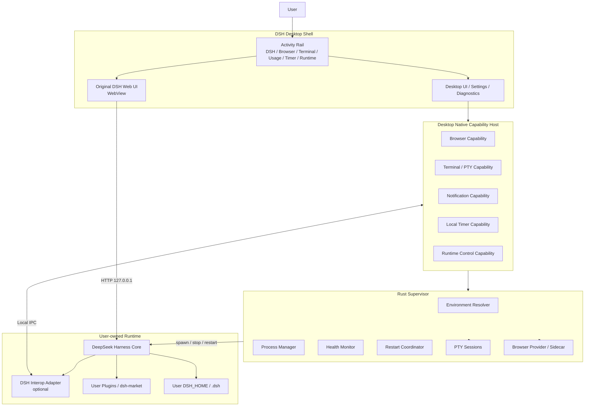
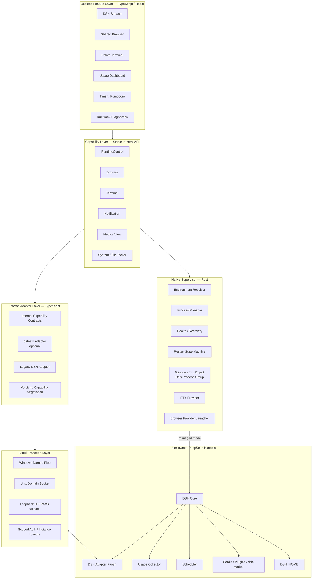
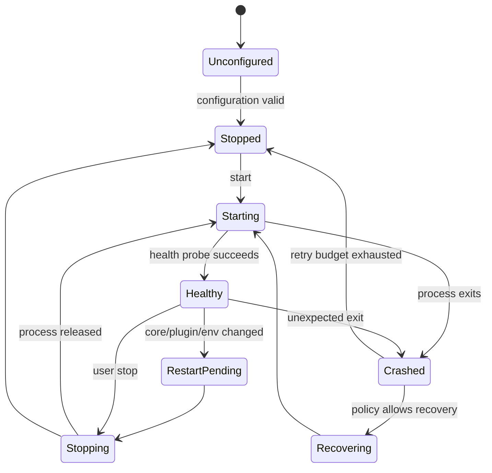
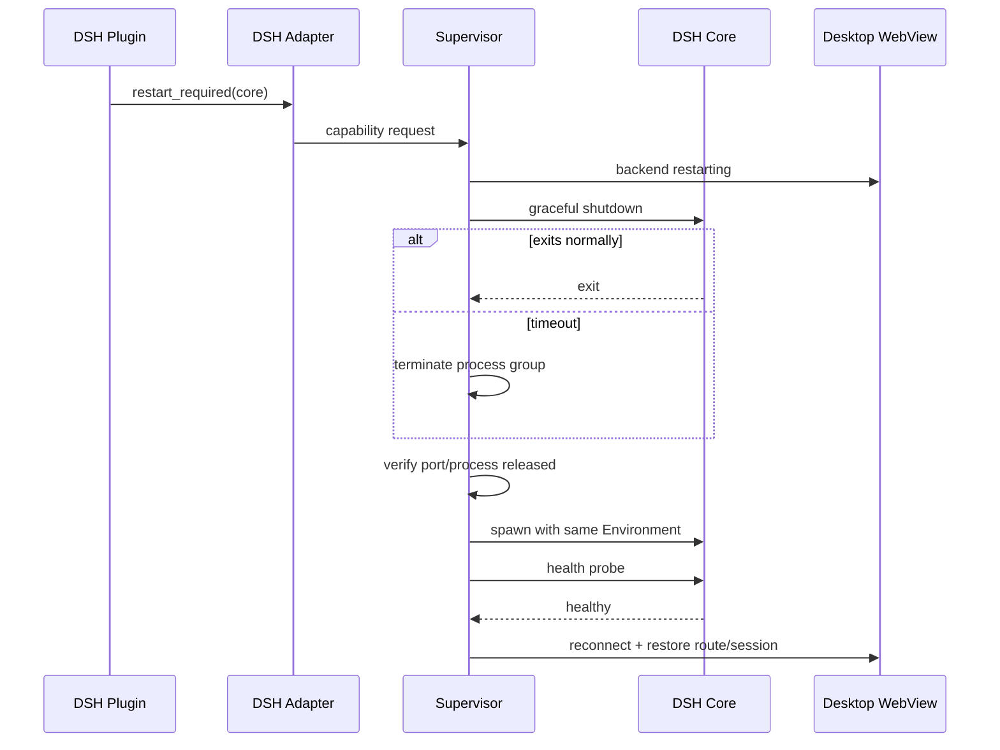
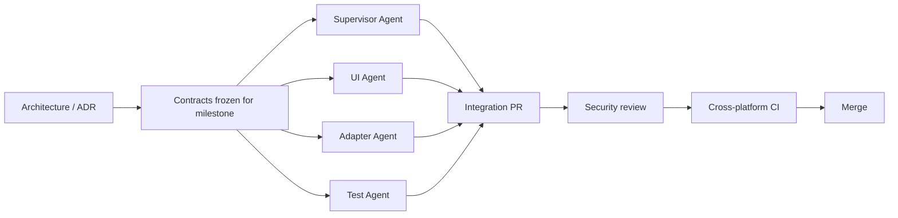
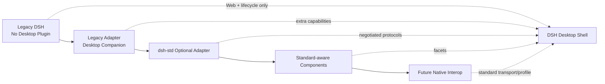
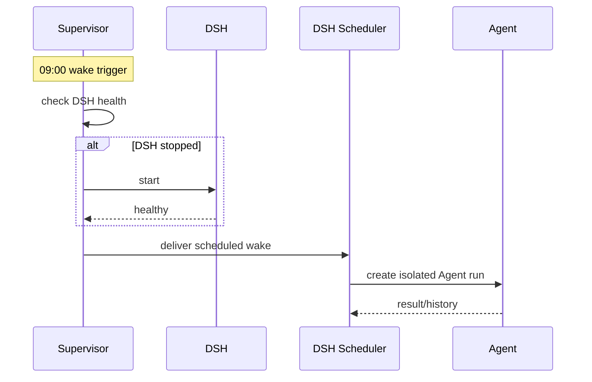
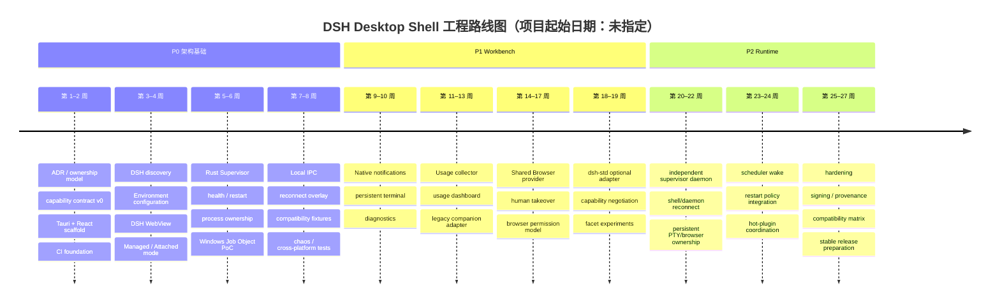

# DSH Desktop Shell：面向工程实施的概念架构、复杂度与 Agent 实现性价比调研报告

## Executive Summary

**研究基线：2026 年 8 月 25 日。**

本报告建议将项目正式定义为 **DSH Desktop Shell**，而不是另一个“DeepSeek Harness Desktop Distribution”。两者最本质的区别是：Desktop Shell **不拥有、不打包、不升级用户的 DSH Core**；它通过用户指定或自动发现已有 `deepseek-harness / dsh` 与 `DSH_HOME`，将其作为一个独立后端进程连接、监控和管理。

这一方向与 DeepSeek Harness 自身架构高度兼容。官方 Harness 目前仍处于 Developer Preview，并明确警告会发生 compatibility-breaking changes；同时，DSH 本身是 Cordis 驱动的插件树，模型、工具、Session、Sandbox、UI 等都通过可替换插件与 capability seam 组织。换言之，**尽可能减少 Desktop 对 Harness 内部实现的依赖，正是降低未来兼容成本的正确方向**。citeturn11search11turn11search6

现有 `deepseek-harness-desktop` 已经验证了 Tauri 2 + React + Rust 管理 DSH 生命周期、健康检查、CLI shim、插件、下载、Profile 等方案在工程上是可行的，但它当前把 Node、Harness Core、pnpm 等也纳入自己的发行和生命周期管理；其开发规范还专门处理 debug/release 的端口、`DSH_HOME`、PID 与 Windows 进程树隔离。fileciteturn3file0L2-L2 `deepseek-harness-pkg` 则进一步说明，一旦 Desktop 自己承担 Core Distribution，就必须承担 pinned version、patch、lockfile、四平台构建、上游自动同步和原生依赖 build-script 的供应链问题。fileciteturn5file0L2-L2 **我们的方案可以主动退出这整个责任域。**

因此，推荐的最终责任边界是：

```text
DSH Desktop Shell owns:
    UI shell
    Native capabilities
    Supervisor
    Process lifecycle
    Health / restart / recovery
    PTY
    Browser surface
    OS notifications
    Local IPC
    Compatibility adapters

User owns:
    DeepSeek Harness installation
    Node / pnpm environment
    DSH_HOME
    Profiles
    Plugins
    Credentials
    Harness upgrades
```

Desktop 在界面上可以非常轻：本质上是 **“DSH 专用浏览器 + Activity Rail”**；但从系统角度，它应当被定义为：

> **Browser Surface + Native Capability Host + DSH Supervisor + Interop Adapter**

而不是简单 WebView Wrapper。

核心结论如下。

| 决策问题 | 建议 |
|---|---|
| UI 框架 | **Tauri 2 + React/TypeScript** |
| DSH Core | **复用用户已有安装，不随 Desktop 打包** |
| `.dsh / DSH_HOME` | 用户指定；Desktop 只保存引用 |
| DSH 生命周期 | **Rust Supervisor 管理** |
| P0 Supervisor | 先与 Tauri Rust backend 同进程 |
| 长期 Supervisor | **拆成独立 native daemon** |
| DSH Web UI | 原版远程 WebView，避免 DOM/renderer patch |
| Terminal | xterm.js UI + **Supervisor-owned PTY** |
| Shared Browser | Desktop Surface + 独立 Chromium/Edge/CDP provider，避免绑定 Tauri system WebView 自动化能力 |
| Usage | DSH plugin 收集语义数据，Desktop 展示 |
| Scheduler | DSH 负责 Agent task；后期 Supervisor 负责 wake-up |
| Hot-plugin | 优先 DSH/Cordis HMR；失败再提升为 Core restart |
| Plugin Market | 保留在 DSH，不重新开发 Desktop Market |
| Interop | **dsh-std compatible, not dsh-std required** |
| Transport | Windows Named Pipe / Unix Domain Socket；loopback HTTP/WebSocket 为 fallback |
| Windows 进程树 | **Job Object** |
| 商业开发 | 新项目 clean-room 实现；不要直接 fork/copy 当前 desktop 代码，除非完成 license audit |

`dsh-std` 的架构方向很适合本项目：它以 `apiVersion + kind` 标识协议，通过 `requires / supports` 做协商，把 Adapter 作为上游 API 变化的“shock absorber”，并允许 Desktop、TUI、Web、Headless 等实现只采用自己需要的协议。但项目当前明确标注 code/proposals 为 **early drafts**；其 `connection` 参考实现也尚未标准化 discovery、authentication、encryption、reconnect、framing 和 serialization。因此，目前最合理的策略不是将 Desktop 建在 `dsh-std` 上，而是**在内部结构上对齐它，同时保留自己的 Local Transport 与 Legacy Adapter**。citeturn19search0turn20view0turn20view2

工程投入方面，本报告按“一名熟悉 Rust/TypeScript/桌面工程的工程师的人类等价工作量”估算，Coding Agent 可以显著承担脚手架、UI、Adapter、测试和文档，但不能把跨平台进程管理、安全边界、签名、race condition 与实际 GUI 验证按同样比例压缩。规划值为：

| 阶段 | 目标 | 估算工程量 |
|---|---|---:|
| P0 | 可稳定使用的 Shell + External DSH + Supervisor | **约 2.6–4.1 人月** |
| P1 | Terminal / Browser / Usage / Notification / std adapter | **追加约 3.5–5.9 人月** |
| P2 | 独立 daemon / Scheduler wake / Hot-plugin coordination / hardening | **追加约 2.3–4.0 人月** |
| 完整 v1 架构 | P0–P2 | **约 8.4–14 人月的人类等价工程量** |

这些是**规划估算而非交付承诺**；尤其 macOS 签名/公证、Windows 安装与原生 PTY、Linux WebView 差异，以及未来 DSH breaking changes 都可能改变区间。

总体可行性判断：

**技术可行性：高。**

**架构合理性：高。**

**上游兼容收益：非常高。**

**P0 Agent 开发性价比：高。**

**最大风险并不在 React/Tauri UI，而在 process ownership、native capability 安全边界、browser/PTY 跨平台行为以及 dsh-std/DSH 快速变化。**

## 架构与技术选型

项目的第一原则应当是：

> **Shell、Supervisor、DSH Core、DSH Data 是四个不同的 ownership domain。**

官方 DSH 已经把自身定义成可组合插件树；Profile 是 Harness Home 下的命名 composition，`web`、`headless` 是不同模板，Session、Agent、Tool、Filesystem、Subprocess、Sandbox 等也都有自己的扩展 seam。官方文档甚至明确列出 persistent terminal 应由 terminal backend + tool 组合，而 UI/editor integration 应通过 Agent 和 session events 构建。citeturn11search6

因此 Desktop 无需重新成为 DSH 的“母体”。

**概念架构：**



这里最关键的是：**DSH WebView 只是 Desktop 的一个 Surface，不是 Desktop 内部业务代码。**

现有 `deepseek-harness-desktop` 已经采用 React WebView → Tauri Rust → workflow/process lifecycle → `dsh web` 的基本模式，并默认把 Web UI 服务在 loopback；这证明“UI 与本地 Harness 后端之间通过进程和 localhost 解耦”本身是成熟可行的。fileciteturn3file0L2-L2

但我们的架构进一步取消：

```text
Desktop owns Node
Desktop owns Core bundle
Desktop owns pnpm
Desktop patches renderer
Desktop decides Core version
```

改成：

```text
Desktop references user-owned Harness
Desktop references user-owned DSH_HOME
Desktop owns only lifecycle around it
```

**要求的四层系统架构**可落成如下形式：



### 技术选型比较

Tauri 2 的基本架构就是 Rust native process + OS WebView + IPC；它还有针对 window/webview 的 capability/permission system。需要注意的是，Tauri 默认依赖操作系统 WebView，而不是自行捆绑一个统一 Chromium，因此 Windows、macOS、Linux 的 WebView 实现实际不同。citeturn16search2turn16search6turn16search10turn16search30

Electron 则天然围绕 Chromium 的 BrowserWindow/WebContents/Session 工作，支持 persistent/in-memory partition，对“一个桌面应用里管理多个独立 browser context”更自然。Electron 官方也建议新嵌入式内容场景优先考虑 `WebContentsView` 等方式，而不是旧的 `<webview>` tag。citeturn16search0turn16search3turn16search7turn16search15

| 方案 | 优势 | 劣势 | Shared Browser | Supervisor | 推荐程度 |
|---|---|---|---|---|---:|
| **Electron monolith** | Chromium 一致；Browser/Session API 成熟；TS 团队上手快 | Runtime 较重；native process 控制通常还需 native addon/sidecar；UI 与 Chromium 发布节奏耦合 | ★★★★★ | ★★★ | 7.5/10 |
| **Tauri 2 integrated** | Rust process manager 自然；壳轻；原生权限模型清晰；已有 DSH Desktop 实证 | system WebView 跨平台差异；不适合作为统一的 Chromium automation contract | ★★★ | ★★★★★ | **9/10 P0** |
| **Web + sidecar** | 最小 shell；服务模式和远程访问简单 | 桌面体验弱；窗口、托盘、快捷键、PTY、通知仍要 sidecar | ★★ | ★★★★ | 6.5/10 |
| **Native Supervisor daemon + 任意 Shell** | Shell/Core 生命周期彻底隔离；UI 重启不影响 DSH；PTY/browser 可跨 UI 生命周期持久化 | IPC、daemon install、升级、锁与多实例复杂度明显增加 | 取决于 provider | ★★★★★ | **9.5/10 目标态** |

因此本报告推荐：

```text
P0:
Tauri 2
  ├─ React/TypeScript UI
  └─ Rust Supervisor in-process

P1:
  ├─ PTY
  ├─ Browser provider sidecar
  ├─ Usage
  └─ dsh-std / legacy adapters

P2:
dsh-desktop.exe
        │
        ▼
dsh-supervisor daemon
        │
        ├── DSH
        ├── PTY
        └── Browser provider
```

**Shared Browser 不建议把“Tauri WebView 自动化”作为唯一实现。**

社区 `wqty123/dsh-browser` 已经使用 Electron CDP provider、自托管 browser process 与 RPC，把 `ctx.browser` seam、Browser provider 和模型侧 `browser_*` tools 分层；这恰好证明了 Browser Capability 与具体 desktop shell 应当解耦。citeturn11search16turn20view3 另有 DSH 浏览器插件直接通过真实 Chrome/CDP、浏览器扩展或 WebBridge 驱动已登录浏览器，说明“Shared Human/Agent Browser”已经是一个真实的社区需求，而不是纯理论能力。citeturn15search2turn13search4turn15search14

所以建议：

```text
BrowserCapability
       │
       ├── Provider: Chromium CDP
       ├── Provider: Edge CDP
       ├── Provider: Electron browser sidecar
       └── Future provider: remote browser
```

Desktop UI 只关心：

```text
open
navigate
snapshot
interact
takeOver
close
```

而不知道底层到底是谁。

### 运行模式必须明确区分

建议第一版直接定义：

```ts
type BackendOwnership =
  | "managed"
  | "attached";
```

**Managed：**

```text
Desktop Supervisor
      │ owns PID/process group
      ▼
     DSH
```

允许：

```text
start
stop
restart
crash recovery
restart after upgrade
```

**Attached：**

```text
Existing externally-managed DSH
              ▲
              │ HTTP
          Desktop
```

只允许：

```text
connect
health
render
optional capability negotiation
```

Desktop **不能因为端口属于 DSH 就推断自己拥有该进程，更不能直接 kill。**

这一 ownership boundary 应成为所有 lifecycle API 的硬约束。

### 社区参考实现地图

| 模块 | 主要参考项目 | 我们应吸收的部分 | 不建议复制的部分 |
|---|---|---|---|
| Desktop lifecycle | `deepseek-harness-desktop` | Rust workflow、health、settings、跨平台思路 fileciteturn3file0L2-L2 | Core download、renderer patch、私有发行耦合 |
| Core packaging | `deepseek-harness-pkg` | 用作“我们为什么不承担 Core distribution”的参考 fileciteturn5file0L2-L2 | bundle/pin/patch pipeline |
| DSH architecture | `deepseek-ai/deepseek-harness` | Cordis seam、session/tool/terminal/agent lifecycle citeturn11search6 | 直接引用内部非公开 API |
| Interop | `dsh-std` | capability negotiation、facet、adapter、apiVersion citeturn19search0turn20view2 | 当前尚不稳定的 wire 假设 |
| Market | `dsh-market` | Marketplace 留在 DSH；安全提示、安装/update UX citeturn15search6turn20view7 | Desktop 重新做一套 market |
| Sidebar | `DSH-better-sidebar` | Workbench / Activity Surface 需求验证 citeturn15search0turn15search7 | 重做整个 DSH 内部 sidebar |
| Browser | `wqty123/dsh-browser` | seam/provider/tools 分层、Electron CDP provider citeturn11search16 | 把 Electron 当 Desktop Shell 强依赖 |
| Terminal | `dsh-plugin-terminal`, `dsh-web-terminal` | xterm + real PTY + multi-tab 模型 citeturn11search5turn11search3 | PTY 生命周期继续绑定 DSH Core |
| Usage | `dsh-deepseek-usage-dashboard` | provider usage、projection、host-only credentials、安全 API citeturn12search11 | Desktop 直接绑定日志物理格式 |
| Scheduler | `@opendsh/dsh-plugin-scheduled-tasks` | fresh headless session + durable run history citeturn20view4 | Desktop 自己复制 Agent Scheduler |
| Hot plugin | `dsh-hot-reload` + Cordis HMR | reload → rollback → restart-needed 模型 citeturn20view5turn12search6 | Desktop 直接操作 Cordis internals |
| Notification | `dsh-plugin-task-notification` | turn-complete semantic event → notification citeturn12search16 | Browser Notification API 作为唯一出口 |
| Multi-Agent | `dsh-agent-teams` | durable member/task/dependency/message 模型 citeturn21search0 | Desktop 介入 Agent orchestration |

## 可行性、复杂度与 Agent 性价比

以下工程量为**本报告的规划估算**。口径为一名有 Rust/TypeScript/桌面工程经验的工程师的人类等价工作量；Coding Agent 可以承担代码生成，但人工 review、跨平台实机测试、安全审查与 release signing 不能简单按生成速度折算。

难度：

```text
★      很低
★★     低
★★★    中
★★★★   高
★★★★★ 很高
```

### 工程复杂度评估

| 模块 | 优先级 | 难度 | 核心依赖 | 主要风险 | 估算人月 | 可复用参考 |
|---|---:|---:|---|---|---:|---|
| Shell / Activity Rail / DSH WebView | P0 | ★★ | Tauri, React | WebView navigation、reconnect | 0.25–0.40 | Tauri architecture；现 Desktop citeturn16search2turn16search18 fileciteturn3file0L2-L2 |
| First-run / Environment Config | P0 | ★★ | fs/path、Tauri dialog | 路径、Node/CLI 组合多 | 0.30–0.50 | DSH 官方 npm/source 两种运行模式 citeturn11search11 |
| DSH discovery / Legacy Adapter | P0 | ★★★ | PATH、package metadata | DSH breaking changes | 0.40–0.65 | DSH architecture + adapter 思路 citeturn11search6turn19search1 |
| Supervisor State Machine | P0 | ★★★★ | Rust async/process | restart race、stale PID、port race | 0.65–1.00 | existing workflow；Job Object fileciteturn3file0L2-L2 citeturn16search4 |
| Health / Crash Recovery | P0 | ★★★ | loopback health | 假阳性、启动时间、连续 crash | 0.30–0.50 | existing desktop scheduler/health fileciteturn3file0L2-L2 |
| Local Transport + Auth | P0 | ★★★★ | pipe/UDS/loopback | 权限提升、伪造 peer、token 泄漏 | 0.35–0.60 | dsh-std connection 的 deferred wire 边界 citeturn20view0 |
| Attach / Managed ownership | P0 | ★★★ | process metadata | 错杀外部 DSH | 0.20–0.35 | 本报告设计 |
| Contract / integration tests | P0 | ★★★ | fake DSH、CI matrix | DSH 快速版本变化 | 0.30–0.55 | dsh-std pure negotiation/conformance 思路 citeturn19search0 |
| Native Notifications | P1 | ★★ | OS notification | 权限/Do Not Disturb | 0.15–0.30 | task notification citeturn12search16 |
| Persistent Native Terminal | P1 | ★★★★ | PTY、xterm | Windows PTY、resize、encoding、orphan | 0.65–1.05 | terminal plugins citeturn11search5turn11search3 |
| Usage Collector + Dashboard | P1 | ★★★ | DSH projection/LLM events | schema drift、pricing 与真实账单区别 | 0.45–0.80 | usage dashboard citeturn12search11 |
| Shared Browser | P1 | ★★★★★ | CDP/browser process | auth state、popup/download、security | 1.10–1.90 | dsh-browser 等 citeturn11search16turn15search2 |
| dsh-std Adapter | P1 | ★★★★ | `@dsh-std/*` | spec churn | 0.55–0.95 | adapter-dsh citeturn20view2turn19search1 |
| Diagnostics / log export | P1 | ★★★ | supervisor logs | secrets/path redaction | 0.30–0.55 | dsh-market 已做 sanitized export citeturn15search6 |
| Independent Supervisor daemon | P2 | ★★★★★ | service IPC、update | split-brain、多实例、daemon upgrade | 0.75–1.25 | Tauri sidecar/IPC patterns citeturn16search26 |
| Scheduler Wake | P2 | ★★★★ | daemon + DSH scheduler | sleep/wake、missed schedule | 0.55–0.95 | scheduled-tasks citeturn20view4 |
| Hot-plugin coordination | P2 | ★★★★ | Cordis lifecycle | leaked resources / internal API drift | 0.45–0.80 | official HMR + hot-reload plugin citeturn12search6turn20view5 |
| Cross-platform hardening | P2 | ★★★★★ | Windows/macOS/Linux | signing、WebView、permission、native deps | 0.50–1.00 | Tauri platform/security docs citeturn16search6turn16search10 |

基于上表：

**P0：约 2.6–4.1 人月。**

核心交付是：

```text
External DSH discovery
+ Environment
+ Original Web UI
+ Supervisor
+ Attach/Managed
+ Health
+ Restart
+ IPC
+ Tests
```

这已经是一个**真正有价值的产品**，而不是 demo。

P1 追加约 **3.5–5.9 人月**，主要价值来自 Browser 和 Terminal。

P2 追加约 **2.3–4.0 人月**，主要是从“桌面应用”走向“长期可靠的本地 Agent Runtime”。

### P0 / P1 / P2 功能清单

| Priority | 功能 | 为什么属于这一阶段 |
|---|---|---|
| **P0** | Harness path / DSH_HOME / Node discovery | 项目存在的前提 |
| **P0** | Managed / Attached mode | 防止生命周期 ownership 混乱 |
| **P0** | DSH WebView + reconnect overlay | 最小产品体验 |
| **P0** | Start / stop / restart | Shell 的核心价值 |
| **P0** | Health / crash recovery | restart 才能可信 |
| **P0** | Windows process group / Job Object | 防 orphan process |
| **P0** | Local authenticated IPC | 后续所有 native capabilities 的基座 |
| **P0** | Compatibility fixture / CI matrix | DSH 是 Developer Preview citeturn11search11 |
| **P1** | Native Terminal | 极高日常价值 |
| **P1** | Native Notification | 成本很低、体验提升明显 |
| **P1** | Usage dashboard | 高频可见价值 |
| **P1** | Shared Browser | 产品差异化最大 |
| **P1** | dsh-std optional adapter | 为未来互操作建立边界 |
| **P1** | Diagnostics bundle | 为社区支持/兼容问题降成本 |
| **P2** | standalone supervisor daemon | 生命周期完全隔离 |
| **P2** | persistent scheduled wake | 让 DSH 真正常驻自动化 |
| **P2** | hot-plugin restart coordination | 优化插件开发/升级体验 |
| **P2** | multi-environment simultaneous runtime | dev/stable/test |
| **P2** | security hardening + policy UI | 为扩大用户面准备 |

### Agent 实现性价比

这里需要区分两种“Token 成本”：

**开发 Token**：Coding Agent 阅读上下文、生成实现、测试、修复、review 所需的相对预算。下列数字仅是**工程规划量级**，不是特定模型账单预测。

**运行 Token**：用户真正使用该能力时是否额外触发 LLM token。

开发预算假设每个模块由 Agent 负责主要 scaffold/实现并经过多轮 test/review：

```text
S   < 0.4M 开发 token
M   0.4M – 1.0M
L   1.0M – 2.0M
XL  > 2.0M
```

| Agent/桌面能力 | 用户价值 | Coding Agent 适配度 | 开发 Token | Runtime Token | 工程风险 | 性价比 |
|---|---:|---:|---:|---:|---:|---:|
| Native Notification | 4/5 | **5/5** | S | **0** | 低 | ★★★★★ |
| Usage Collector / UI | 4.5/5 | **5/5** | M | **0**，若基于 event/projection | 中 | ★★★★★ |
| Runtime Supervisor UI | **5/5** | 4/5 | M–L | **0** | 高 | ★★★★★ |
| Native Terminal | **5/5** | 4/5 | M–L | 人工使用 0；Agent 读 terminal 时可变 | 高 | ★★★★★ |
| Shared Browser | **5/5** | 3.5/5 | L–XL | 中–高，取决于 snapshot 策略 | 很高 | ★★★★☆ |
| dsh-std Negotiation | 2/5 直接价值 / 5/5 战略价值 | 4.5/5 | M–L | 近乎 0 | spec churn | ★★★★☆ |
| Hot-plugin Coordination | 4/5 开发者价值 | 3.5/5 | M–L | 0 | 高 | ★★★★ |
| Agent Scheduler | 4.5/5 | 4/5 | M–L | **高且取决于任务** | 中高 | ★★★★ |
| Independent daemon | 3/5 可见价值 / 5/5 稳定价值 | 3/5 | L | 0 | 很高 | ★★★★ |
| Desktop Plugin Market | 2/5 | 5/5 | M | 0 | 重复建设 | ★★ |

Usage 的高性价比已有社区实证：`dsh-deepseek-usage-dashboard` 基于 session projection/usage 数据完成统计和展示，README 明确说明 capture/display 本身不会发起 LLM 调用，因此这一类监控能力完全可以做到**零额外模型 token**。citeturn12search11

Scheduler 则相反。社区 scheduled-task 实现选择为每次计划运行启动新的 headless Agent Session，并持久化 run history；因此其**调度本身很便宜，真正的 Token 成本来自被调度 Agent 的任务**。citeturn20view4turn13search10

Shared Browser 的运行 Token 需要主动控制。建议不要不断把整页 DOM/截图塞给模型，而采用：

```text
accessibility snapshot
        ↓
stable refs
        ↓
delta / focused snapshot
        ↓
specific interaction
```

这样 Browser 是高价值能力，而不是 Token 黑洞。

### Agent 最擅长和最不适合承担的部分

**特别适合 Coding Agent：**

```text
React UI
TypeScript contracts
config schema
dsh adapters
usage collectors
test fixtures
JSON schema
docs
CI YAML
migration adapters
diagnostic formatting
```

**必须重点人工 review：**

```text
Windows Job Object unsafe FFI
process ownership
force-kill fallback
named-pipe ACL
Unix socket permissions
capability authorization
browser credential/profile isolation
PTY lifecycle
signing/notarization
self-update
race/reconnect state machine
```

换言之，Coding Agent 能大幅降低“代码量”的成本，却不能等比例降低“正确性证明”的成本。

这也是为什么 **P0 应先做生命周期与协议边界，而不是先堆功能**。

## 代码地图与实现脚手架

建议一开始就采用 Monorepo，但不要把所有东西塞进一个 Tauri `src-tauri/src`。

建议：

```text
dsh-desktop-shell/
│
├─ apps/
│  └─ desktop/                              [TypeScript + Tauri]
│     ├─ src/
│     │  ├─ app/
│     │  ├─ routes/
│     │  ├─ components/
│     │  ├─ features/
│     │  │  ├─ harness/
│     │  │  ├─ browser/
│     │  │  ├─ terminal/
│     │  │  ├─ usage/
│     │  │  ├─ timer/
│     │  │  └─ runtime/
│     │  ├─ stores/
│     │  └─ services/
│     │
│     └─ src-tauri/
│        ├─ Cargo.toml
│        ├─ capabilities/
│        ├─ tauri.conf.json
│        └─ src/
│           ├─ lib.rs
│           ├─ commands.rs
│           └─ state.rs
│
├─ crates/
│  ├─ supervisor/                           [Rust]
│  │  ├─ src/
│  │  │  ├─ lib.rs
│  │  │  ├─ state_machine.rs
│  │  │  ├─ environment.rs
│  │  │  ├─ discovery.rs
│  │  │  ├─ health.rs
│  │  │  ├─ restart.rs
│  │  │  └─ ownership.rs
│  │
│  ├─ process-manager/                      [Rust]
│  │  ├─ src/
│  │  │  ├─ process.rs
│  │  │  ├─ windows_job.rs
│  │  │  ├─ unix_group.rs
│  │  │  └─ signals.rs
│  │
│  ├─ local-transport/                      [Rust]
│  │  ├─ src/
│  │  │  ├─ server.rs
│  │  │  ├─ auth.rs
│  │  │  ├─ framing.rs
│  │  │  ├─ named_pipe.rs
│  │  │  └─ unix_socket.rs
│  │
│  ├─ terminal-provider/                    [Rust]
│  │  └─ src/
│  │     ├─ session.rs
│  │     ├─ pty.rs
│  │     └─ registry.rs
│  │
│  └─ browser-provider/                     [Rust launcher / TS sidecar]
│     ├─ src/
│     └─ sidecar/
│
├─ packages/
│  ├─ capability-contracts/                 [TypeScript]
│  │  └─ src/
│  │     ├─ core.ts
│  │     ├─ runtime.ts
│  │     ├─ browser.ts
│  │     ├─ terminal.ts
│  │     └─ notification.ts
│  │
│  ├─ adapter-dsh/                          [TypeScript / DSH Plugin]
│  │  ├─ src/
│  │  │  ├─ index.ts
│  │  │  ├─ discovery.ts
│  │  │  ├─ transport.ts
│  │  │  └─ capabilities/
│  │  └─ cordis.patch.yml
│  │
│  ├─ adapter-dsh-std/                      [TypeScript]
│  │  └─ src/
│  │     ├─ negotiation.ts
│  │     ├─ facets.ts
│  │     └─ mapping.ts
│  │
│  ├─ usage-collector/                      [TypeScript / DSH Plugin]
│  ├─ browser-agent-adapter/                [TypeScript / DSH Plugin]
│  └─ terminal-agent-adapter/               [TypeScript / DSH Plugin]
│
├─ protocol/
│  ├─ schemas/
│  ├─ fixtures/
│  └─ compatibility/
│
├─ tests/
│  ├─ unit/
│  ├─ contract/
│  ├─ integration/
│  ├─ e2e/
│  ├─ chaos/
│  └─ fake-dsh/
│
├─ docs/
│  ├─ architecture/
│  ├─ protocol/
│  ├─ security/
│  ├─ compatibility/
│  └─ decisions/
│
├─ .github/
│  ├─ workflows/
│  ├─ ISSUE_TEMPLATE/
│  ├─ PULL_REQUEST_TEMPLATE.md
│  ├─ CODEOWNERS
│  └─ dependabot.yml
│
├─ AGENTS.md
├─ CONTRIBUTING.md
├─ SECURITY.md
├─ LICENSE
└─ README.md
```

其中最终许可证 **未指定**；本报告后文给出建议。

### Rust / TypeScript ownership

| 范围 | 建议语言 | 原因 |
|---|---|---|
| Supervisor state machine | **Rust** | process lifecycle 是 native control-plane |
| Windows Job Object | **Rust** | 直接 Win32 API |
| Process tree / signals | **Rust** | 与 GUI/Node 生命周期解耦 |
| Local IPC server | **Rust** | 提供系统级 boundary |
| PTY backend | **Rust** | 最终使 PTY 不依赖 DSH/Node |
| Browser process launcher | **Rust** | process ownership |
| Browser automation sidecar | TypeScript 可接受 | CDP / Chromium 生态成熟 |
| React UI | **TypeScript** | 最高 Agent 产出效率 |
| Capability contracts | **TypeScript** + JSON Schema | DSH/plugin 易消费 |
| DSH Adapter | **TypeScript** | DSH 本身 TS/Node/Cordis |
| dsh-std adapter | **TypeScript** | 直接映射协议包 |
| Usage collector | **TypeScript** | DSH event/session 层 |
| Agent tool adapters | **TypeScript** | 与 DSH Tool API 一致 |

当前 `deepseek-harness-desktop` 也是 React/TS + Rust/Tauri 的划分，其 Rust backend 已经包含 download、workflow、scheduler、CLI 等 native service，说明这条语言边界本身合理。fileciteturn3file0L2-L2

### Environment 数据模型

```ts
export type BackendOwnership = "managed" | "attached";

export interface DshEnvironment {
  id: string;
  label: string;

  harness: {
    mode: "repository" | "executable" | "command";
    path: string;
  };

  dshHome: string;
  profile: string;

  endpoint: {
    host: "127.0.0.1";
    port: number | "auto";
  };

  nodePath?: string;

  ownership: BackendOwnership;
}
```

例如：

```json
{
  "id": "dev",
  "label": "DSH Dev",
  "harness": {
    "mode": "repository",
    "path": "D:\\git\\deepseek-harness"
  },
  "dshHome": "C:\\Users\\user\\.dsh-dev",
  "profile": "web",
  "endpoint": {
    "host": "127.0.0.1",
    "port": 3081
  },
  "ownership": "managed"
}
```

这样可以自然扩展：

```text
Stable
Dev
Experimental
Client A
Client B
```

Desktop 不需要理解这些目录内部的 Profile layout，只负责启动命令与环境。

### Rust Supervisor 接口

```rust
#[derive(Debug, Clone, Copy, PartialEq, Eq)]
pub enum BackendOwnership {
    Managed,
    Attached,
}

#[derive(Debug, Clone, Copy, PartialEq, Eq)]
pub enum BackendState {
    Unconfigured,
    Stopped,
    Starting,
    Healthy,
    RestartPending,
    Stopping,
    Recovering,
    Crashed,
}

#[derive(Debug, Clone)]
pub struct StartSpec {
    pub harness_path: std::path::PathBuf,
    pub dsh_home: std::path::PathBuf,
    pub profile: String,
    pub host: String,
    pub port: u16,
    pub node_path: Option<std::path::PathBuf>,
}

#[derive(Debug, Clone)]
pub struct BackendStatus {
    pub state: BackendState,
    pub ownership: BackendOwnership,
    pub pid: Option<u32>,
    pub endpoint: Option<String>,
    pub restart_count: u32,
}

pub trait HarnessSupervisor: Send + Sync {
    async fn start(&self, spec: StartSpec) -> Result<BackendStatus, SupervisorError>;

    async fn stop(&self) -> Result<BackendStatus, SupervisorError>;

    async fn restart(
        &self,
        reason: RestartReason,
    ) -> Result<BackendStatus, SupervisorError>;

    async fn status(&self) -> Result<BackendStatus, SupervisorError>;
}
```

Restart reason 不应该是一个模糊字符串：

```rust
pub enum RestartReason {
    UserRequested,
    CoreChanged,
    PluginRequiresRestart,
    HealthFailure,
    EnvironmentChanged,
    Recovery,
}
```

### Windows Job Object

现有 Desktop 开发规范当前使用 Windows process-tree kill 思路。fileciteturn3file0L2-L2 长期实现更建议切换到 Job Object：Microsoft 文档明确允许把一组进程作为整体管理，而 `JOB_OBJECT_LIMIT_KILL_ON_JOB_CLOSE` 可在 Job Object 最后一个 handle 关闭时结束所关联的进程树。citeturn16search4turn16search24

概念接口：

```rust
#[cfg(windows)]
pub struct WindowsProcessGroup {
    job_handle: windows_sys::Win32::Foundation::HANDLE,
}

#[cfg(windows)]
impl WindowsProcessGroup {
    pub fn new_kill_on_close() -> Result<Self, ProcessError> {
        // CreateJobObjectW
        // SetInformationJobObject(
        //   JOB_OBJECT_LIMIT_KILL_ON_JOB_CLOSE
        // )
        todo!()
    }

    pub fn assign(&self, process_handle: isize) -> Result<(), ProcessError> {
        // AssignProcessToJobObject
        todo!()
    }
}
```

真正 stop 流程仍应是：

```text
graceful request
      ↓
wait
      ↓
soft OS termination
      ↓
wait
      ↓
force terminate process group
      ↓
confirm endpoint released
```

而不是把强制终止作为第一选择。

### Capability Contract

不要设计一个：

```ts
interface EverythingDesktopCanDo {}
```

建议每项 capability 独立版本。

```ts
export interface ProtocolCoordinate {
  apiVersion: string;
  kind: string;
}

export interface CapabilityRequirement {
  coordinate: ProtocolCoordinate;
  required: boolean;
}

export interface ParticipantDeclaration {
  participantId: string;
  requires: CapabilityRequirement[];
  supports: ProtocolCoordinate[];
}
```

内部临时协议可以是：

```ts
export const RuntimeControl = {
  apiVersion: "desktop.dsh.local/v1alpha1",
  kind: "RuntimeControl",
} as const;

export const Terminal = {
  apiVersion: "desktop.dsh.local/v1alpha1",
  kind: "Terminal",
} as const;

export const Browser = {
  apiVersion: "desktop.dsh.local/v1alpha1",
  kind: "Browser",
} as const;
```

**这些名称是本项目拟议名称，不是当前 dsh-std 标准协议。**

当社区出现相应标准：

```text
desktop.dsh.local/v1alpha1
            ↓ adapter
future-standard-coordinate/v1
```

Feature layer 无需变化。

这种 `apiVersion + kind` 和 `requires/supports` 结构直接借鉴 dsh-std 的 meta-protocol，而不强制依赖其 npm package。`dsh-std` 明确设计成“实现不必依赖 reference package，只要满足协议即可”，因此这种兼容策略符合其设计目标。citeturn19search0

### Browser capability

```ts
export interface BrowserSession {
  id: string;
  title?: string;
  url?: string;
}

export interface BrowserCapability {
  create(options?: {
    persistentProfile?: string;
  }): Promise<BrowserSession>;

  navigate(sessionId: string, url: string): Promise<void>;

  snapshot(
    sessionId: string,
    options?: {
      mode: "accessibility" | "text" | "screenshot";
    },
  ): Promise<BrowserSnapshot>;

  interact(
    sessionId: string,
    action: BrowserAction,
  ): Promise<BrowserActionResult>;

  close(sessionId: string): Promise<void>;
}
```

Agent 不应该直接拿一个 unrestricted CDP socket。

DSH adapter 暴露：

```text
browser_open
browser_snapshot
browser_click
browser_type
...
```

但每次调用仍经过 DSH tool policy 和 Desktop capability grant。

### Terminal capability

```ts
export interface TerminalCreateOptions {
  cwd: string;
  shell?: string;
  cols: number;
  rows: number;
}

export interface TerminalCapability {
  create(options: TerminalCreateOptions): Promise<{ id: string }>;

  write(id: string, data: Uint8Array): Promise<void>;

  resize(id: string, cols: number, rows: number): Promise<void>;

  close(id: string): Promise<void>;
}
```

这里的关键区别：

```text
错误:
DSH Core
   └── node-pty

推荐:
Supervisor
   └── PTY
```

社区终端插件已经证明 xterm.js + node-pty + WebSocket 可以提供真实交互式终端。citeturn11search3turn11search5 我们把 PTY ownership 上移一层后，可获得一个非常重要的行为：

```text
DSH restart
     │
     ├──────── Terminal A still running
     ├──────── Terminal B still running
     │
     └──────── Browser session still running
```

这正是 Desktop Shell 相比普通 Web plugin 的结构性优势。

PTY Rust crate 当前 **未指定**；建议在 P1 前独立 PoC Windows/macOS/Linux 的 shell、resize、UTF-8、Ctrl+C、exit code 后再决定。

### Local Transport

`dsh-std/connection` 当前明确表示，其 reference implementation 还没有标准化 discovery、authentication、encryption、reconnect、framing 或 serialization。citeturn20view0 因此我们没有理由等待一个不存在的 wire standard。

建议：

```text
Windows:
\\.\pipe\dsh-desktop-<instance>

Linux/macOS:
$XDG_RUNTIME_DIR/dsh-desktop/<instance>.sock
```

Fallback：

```text
127.0.0.1:<random-port>
+
random per-instance bearer secret
```

Managed DSH spawn 时：

```text
DSH_DESKTOP_ENDPOINT=<endpoint>
DSH_DESKTOP_TOKEN=<ephemeral-token>
DSH_DESKTOP_INSTANCE=<instance-id>
```

**不要使用固定全局 token。**

**不要监听 `0.0.0.0`。**

`deepseek-harness-pkg` 自身也专门警告，将 DSH Web 暴露到 LAN 会暴露具备本地代码执行能力的 Surface，因此默认 loopback 是正确安全基线。fileciteturn5file0L2-L2

### Restart State Machine



Restart orchestration：



这样“插件升级导致 Core 重启”不会导致：

```text
Desktop exits
Terminal exits
Browser exits
Timer exits
```

只有 DSH Surface 短暂进入 reconnect overlay。

## 互操作、多 Agent 与安全测试

`dsh-std` 对本项目最大的价值并不是让我们今天获得一个现成 RPC，而是帮我们确定**稳定边界应该长什么样**。

其 meta-protocol 将协议用 `apiVersion + kind` 标识，每个协议独立版本化，通过 Participant 的 `requires / supports` 做 compatibility negotiation；Adapter 隔离具体产品类型。项目还提出 Component → Facet → Activation → Participant 的生命周期模型。citeturn19search0turn19search1

其当前 DSH adapter 已开始扫描普通 Profile dependency 中的 `dsh-plugin.json`、协商 contracts、加载 host facets，并保持 Cordis/Agent/DSH command registry 等产品类型只存在于 adapter 内。citeturn20view2

这与我们的目标非常一致。

### 对 dsh-std 的兼容原则

应写入项目 Architecture Decision Record：

```text
DSH Desktop Shell SHALL NOT require dsh-std.

DSH Desktop Shell SHOULD expose an architecture
that can map to dsh-std protocols.

DSH-specific types SHALL NOT cross the adapter boundary.
```

即：

```text
Desktop Features
      │
      ▼
Internal Capability Contracts
      │
      ├──────── Legacy DSH Adapter
      │
      └──────── dsh-std Adapter
```

而不是：

```text
Desktop Feature
      ↓
import Cordis Context
      ↓
import DSH internal registry
```

### Capability negotiation

假设 Desktop 支持：

```json
{
  "participantId": "desktop-shell",
  "supports": [
    {
      "apiVersion": "desktop.dsh.local/v1alpha1",
      "kind": "Terminal"
    },
    {
      "apiVersion": "desktop.dsh.local/v1alpha1",
      "kind": "Browser"
    },
    {
      "apiVersion": "desktop.dsh.local/v1alpha1",
      "kind": "Notification"
    }
  ]
}
```

某插件要求：

```json
{
  "participantId": "browser-agent-adapter",
  "requires": [
    {
      "coordinate": {
        "apiVersion": "desktop.dsh.local/v1alpha1",
        "kind": "Browser"
      },
      "required": true
    }
  ],
  "supports": []
}
```

则：

```text
Desktop Shell:
Browser = available
→ activate browser facet

ordinary dsh web:
Browser = unavailable
→ browser facet does not activate
```

这远好于：

```js
if (window.__DESKTOP__)
```

也比：

```js
if (process.env.DESKTOP)
```

更具有长期可扩展性。

### Facet 模型

建议一个未来 Standard-aware component 可以拥有：

```text
Component: Shared Browser
│
├─ host facet
│    └─ DSH agent tools
│
├─ browser/client facet
│    └─ DSH UI integration
│
└─ desktop facet / capability requirement
     └─ Browser provider
```

当前 dsh-std adapter 已经开始把 browser-local UI contribution、host facet 与其他 host mapping 分开，并强调 Web、Desktop、TUI 是 capabilities，而不是写死的 profile classes。citeturn20view2

这对我们特别重要：

> **插件不应该依赖“Desktop”这个品牌；它应该依赖 Browser、Terminal、Notification 等 capability。**

未来这些 capability 完全可能来自：

```text
Desktop
Remote Host
SSH runtime
Browser daemon
Cloud sandbox
```

### Legacy DSH 兼容

因为传统 DSH plugin 并没有 `dsh-plugin.json` 标准 Manifest，而 `dsh-std` 自己也将 existing plugin adoption 列为尚未解决的问题。citeturn19search1

所以至少几年内 Legacy Adapter 都不应被视为临时垃圾代码。

建议能力梯度：

| Backend | Desktop 功能 |
|---|---|
| 普通 DSH，无 adapter | WebView、health、managed restart |
| 普通 DSH + legacy companion | notification、usage、restart request、基础 capability |
| DSH + dsh-std adapter | standard negotiation/facets |
| future native-standard DSH | adapter 可逐步变薄 |

也就是说：

```text
Compatibility is additive.
```

而不是：

```text
Install dsh-std or Desktop fails.
```

### Restart Policy 应标准化为等级而不是 Boolean

Cordis 官方支持 composition/HMR：插件可以被 unmount/remount，配置 diff 也可以只重载对应条目。citeturn12search6 社区 `dsh-hot-reload` 又证明 installed plugin upgrade 可以尝试 in-process swap，失败时保留旧版本并提示“restart required”；其 README 也明确警告，插件若绕过 Cordis lifecycle 持有裸 timer/socket/watcher/process，会出现 silent resource leak。citeturn20view5

因此 Desktop 应采用：

```ts
export type ReloadPolicy =
  | "none"
  | "client_reload"
  | "plugin_reload"
  | "core_restart"
  | "runtime_restart";
```

决策树：

```text
UI asset
   ↓
client_reload

Cordis-safe plugin
   ↓
plugin_reload

plugin reload fails
   ↓
core_restart

Node/runtime/environment changed
   ↓
runtime_restart
```

Desktop **不要自己做 plugin HMR**。

它只是最后一层 restart coordinator。

### Runtime Multi-Agent 权限边界

官方 DSH 架构本身已经支持 per-agent scoped registrations，以及 tool execution pipeline 和 sandbox/approval capability。citeturn11search6 社区 `dsh-agent-teams` 进一步验证了 captain/member、dependency-aware task、durable message、continuable subagent 这样的多 Agent 模型。citeturn21search0

Desktop 不应该成为新的 Agent orchestrator。

正确模型是：

```text
Agent A
Agent B
Agent C
   │
   ▼
DSH permission / tool layer
   │
   ▼
Desktop capability adapter
   │
   ▼
Capability Broker
```

绝对不要：

```text
Agent
   ↓
raw Desktop IPC
   ↓
CreateProcess / CDP / filesystem
```

推荐安全边界：

| Capability | Human UI | Agent |
|---|---|---|
| Terminal display | 默认允许 | 工具权限控制 |
| Terminal keystroke | 允许 | 需要 tool grant |
| Browser view | 允许 | 允许 snapshot |
| Browser navigation | 允许 | 需要 browser grant |
| Password/autofill | Human only 默认 | 不直接公开 |
| File picker | 允许 | 只返回用户选择结果 |
| Core restart | 允许 | 默认需明确 policy |
| Process kill arbitrary PID | **禁止** | **禁止** |
| Raw local IPC | 不公开 | 不公开 |
| Credentials | Desktop 不应读取 DSH credential 内容 | 不公开 |

### Capability lease

每项能力都应该和：

```text
participant
activation
session
owner
```

建立关系。

例如：

```ts
interface CapabilityLease {
  leaseId: string;
  participantId: string;
  capability: ProtocolCoordinate;

  scope: {
    sessionId?: string;
    workspace?: string;
    domains?: string[];
  };

  expiresAt?: number;
}
```

这样：

```text
plugin unload
session close
connection close
agent dispose
```

都能撤销 lease。

这与 dsh-std adapter 当前强调的 activation-instance ownership、publication barrier、deactivate/reload 时原子撤销 registration 的设计高度一致。citeturn19search1turn20view2

### 多 Coding Agent 协作开发

开发本项目本身也非常适合 multi-Agent，但前提是**接口先行**。

推荐分工：

| Agent | Ownership | 是否可并行 |
|---|---|---|
| Architecture Agent | ADR / contracts / schemas | 最先 |
| Rust Supervisor Agent | state machine / health/process | ✅ |
| Platform Agent | Windows/macOS/Linux primitives | ✅，但需要人工 review |
| UI Agent | React / Activity Rail / setup | ✅ |
| Adapter Agent | legacy DSH / dsh-std | ✅ |
| Terminal Agent | PTY / xterm integration | P1 |
| Browser Agent | CDP provider / surface | P1 |
| Test Agent | fake DSH / chaos / contract tests | 从 P0 同步进行 |
| Security Agent | threat model / permission review | 全程 |

正确流程：



不要让四个 Agent 同时：

```text
改 protocol.ts
改 supervisor state
改 config schema
改 IPC envelope
```

否则最终只是把人的 merge conflict 变成 Agent 的 merge conflict。

建议 root `AGENTS.md` 只定义：

```text
architecture invariants
dependency rules
testing requirements
security rules
formatting
ownership
```

再在：

```text
crates/supervisor/AGENTS.md
packages/adapter-dsh/AGENTS.md
apps/desktop/AGENTS.md
```

定义局部规则。

现有 `deepseek-harness-desktop` 本身已经通过 `AGENTS.md` 对 React、Rust backend、Windows process behavior、testing 等作了非常具体的 Agent 编码约束，这说明 agent-oriented repository governance 对这一生态已经是实际实践。fileciteturn3file0L2-L2 官方 DeepSeek Harness 也直接在 README 中要求 Coding Agent 遵循仓库 `AGENTS.md`。citeturn11search11

### 测试策略

**Unit：**

```text
state machine
environment validation
restart policy
capability negotiation
protocol validators
path resolution
log redaction
```

**Contract：**

```text
Desktop protocol fixture
legacy adapter fixture
dsh-std fixture
fake DSH
multiple supported DSH shapes
```

**Integration：**

```text
start real DSH
health
restart
route reconnect
terminal survives restart
browser survives restart
usage continues
```

**Chaos：**

```text
DSH crashes during start
port occupied
stale PID
DSH exits before health
plugin makes boot fail
IPC disconnect
malformed message
Browser provider crashes
PTY child exits
Desktop UI restarts
Supervisor restarts
```

**跨平台：**

```text
Windows latest supported
macOS arm64
macOS x64 if supported
Linux WebKitGTK target distro(s)
```

Tauri 使用 OS WebView，且不同平台 Inspector/engine 都不同，因此至少基础 smoke/e2e 必须在真实 OS matrix 上跑，而不能只在 Linux CI 上推断 Windows/macOS 正确。citeturn16search10turn16search30

**安全测试：**

```text
unauthorized IPC client
stale/replayed token
other-user local access
path traversal
symlink escape
arbitrary executable path
malicious browser page
credential extraction attempt
Terminal cwd escape
agent bypasses permission
fake restart request
external PID ownership spoofing
log secret leakage
```

## GitHub 工程治理、CI/CD 与许可合规

这个项目非常适合采用 **trunk-based + short-lived branches**，而不建议建立长期 `develop`。

原因不是 GitHub 本身，而是 DSH 当前变化太快：长生命周期分支越多，兼容层越容易同时漂移。

建议：

```text
main
│
├─ feat/supervisor-state-machine
├─ feat/terminal-capability
├─ feat/dsh-std-adapter
├─ fix/windows-job-object
└─ chore/ci-macos
```

只有在需要维护已发布 minor 系列时再创建：

```text
release/0.2
```

### Branch / PR Policy

`main`：

```text
no direct push
required PR
required CI
required review
linear/squash history
```

GitHub 的 protected branches/rulesets 可以要求 review 与 status checks 在 merge 前通过。citeturn17search0turn17search4turn17search8

推荐 CODEOWNERS：

```text
/crates/supervisor/          @runtime-maintainers
/crates/process-manager/     @runtime-maintainers @security-maintainers
/crates/local-transport/     @security-maintainers
/packages/adapter-dsh/       @interop-maintainers
/packages/adapter-dsh-std/   @interop-maintainers
/apps/desktop/               @ui-maintainers
/.github/                    @maintainers
```

Review policy：

| 改动 | Review |
|---|---:|
| UI | 1 |
| Adapter | 1 + contract tests |
| Protocol contract | 2 |
| Supervisor/process | 2 |
| Security/IPC | 2，至少一名 security owner |
| Release/signing | maintainer approval |

### Issue 模板

建议至少：

```text
bug.yml
compatibility.yml
feature.yml
security-contact.md
```

`compatibility.yml` 特别重要，应收集：

```text
OS
Desktop version
DSH version / git SHA
DSH installation mode
managed / attached
Node version
profile
DSH_HOME location type
plugin list (optional)
reproduction
sanitized log
```

**不要要求用户直接上传：**

```text
credentials
full settings
raw .dsh
API keys
full session contents
```

GitHub 官方 Issue/PR templates 可以帮助贡献者自动携带项目需要的 context。citeturn17search1turn17search5turn17search17

PR Template 建议：

```markdown
## Scope

## Architecture impact

## Protocol changes

- [ ] No protocol change
- [ ] Backward compatible
- [ ] Breaking change + migration included

## Platform impact

- [ ] Windows
- [ ] macOS
- [ ] Linux

## Security impact

## Tests

## DSH compatibility tested

## Source / License provenance

## Agent participation

- [ ] Human authored
- [ ] Agent assisted
- [ ] Primarily Agent generated

## Screenshots / logs
```

“Agent participation”不是为了歧视 Agent 代码，而是方便 reviewer 判断哪些部分可能需要额外检查，例如大规模机械生成、平台 API 或错误处理。

### CI Pipeline

GitHub Actions 的 matrix strategy 正适合同时跑多个操作系统和版本组合。citeturn16search17

建议 PR CI：

```yaml
name: ci

on:
  pull_request:
  push:
    branches: [main]

concurrency:
  group: ci-${{ github.ref }}
  cancel-in-progress: true

jobs:
  frontend:
    runs-on: ubuntu-latest
    steps:
      - uses: actions/checkout@v4

      - uses: pnpm/action-setup@v4
        with:
          version: 10

      - uses: actions/setup-node@v4
        with:
          node-version: 24
          cache: pnpm

      - run: pnpm install --frozen-lockfile
      - run: pnpm lint
      - run: pnpm typecheck
      - run: pnpm test

  rust:
    strategy:
      fail-fast: false
      matrix:
        os:
          - ubuntu-latest
          - windows-latest
          - macos-latest

    runs-on: ${{ matrix.os }}

    steps:
      - uses: actions/checkout@v4

      - uses: dtolnay/rust-toolchain@stable
        with:
          components: rustfmt, clippy

      - run: cargo fmt --all -- --check
      - run: cargo clippy --workspace --all-targets -- -D warnings
      - run: cargo test --workspace

  contracts:
    runs-on: ubuntu-latest
    steps:
      - uses: actions/checkout@v4
      - uses: pnpm/action-setup@v4
      - uses: actions/setup-node@v4
        with:
          node-version: 24

      - run: pnpm install --frozen-lockfile
      - run: pnpm test:contracts
      - run: pnpm test:compat
```

GitHub Actions 支持 artifacts 在 jobs 间传递和保存，因此 release 构建可以分别在三平台生成 artifact，再由最终 release job 聚合。citeturn16search1

### Release Pipeline

推荐三个 channel：

```text
nightly
beta
stable
```

SemVer：

```text
v0.1.0-beta.1
v0.1.0
v0.2.0
```

GitHub Releases 本身基于 Git tags，适合将 release artifact 与源码历史一一对应。citeturn17search3

Release：

```yaml
name: release

on:
  push:
    tags:
      - "v*"

permissions:
  contents: write
  id-token: write
  attestations: write

jobs:
  build:
    strategy:
      matrix:
        os:
          - windows-latest
          - macos-latest
          - ubuntu-latest

    runs-on: ${{ matrix.os }}

    steps:
      - uses: actions/checkout@v4

      # setup Node / pnpm / Rust omitted

      - run: pnpm install --frozen-lockfile
      - run: pnpm tauri build

      - uses: actions/upload-artifact@v4
        with:
          name: desktop-${{ matrix.os }}
          path: apps/desktop/src-tauri/target/release/bundle/**

  publish:
    needs: build
    runs-on: ubuntu-latest

    steps:
      - uses: actions/download-artifact@v4
        with:
          path: dist

      - name: Publish GitHub Release
        env:
          GH_TOKEN: ${{ github.token }}
        run: |
          gh release create "${GITHUB_REF_NAME}" \
            dist/**/* \
            --generate-notes
```

生产 release 再增加：

```text
Windows signing
macOS signing
macOS notarization
checksum
SBOM
artifact provenance
```

GitHub Artifact Attestations 可以为构建 artifact 生成加密签名的 provenance 声明，帮助用户验证构建从哪个 repository/workflow 产生。citeturn17search2turn17search6

Signing identity、Apple Developer account、Windows certificate/trusted signing provider 当前均 **未指定**。

### Contributor Flow

建议：

```text
Issue / proposal
      ↓
ADR if architectural
      ↓
short-lived branch
      ↓
PR
      ↓
CI
      ↓
CODEOWNER review
      ↓
security review when required
      ↓
squash merge
```

协议变化必须：

```text
schema update
+
CHANGELOG
+
compat fixture
+
migration note
```

禁止：

```text
“顺手”改变 wire envelope
“顺手”暴露一个 raw native command
“顺手”引用 DSH internal type
```

Architecture boundary 的每次突破都必须 ADR。

### License / Commercial Risk 审计页

这是当前项目最需要认真处理的非技术风险。

**DeepSeek Harness：**

官方仓库明确标为 MIT，并同时维护第三方依赖 notices。citeturn11search11

**dsh-std：**

当前仓库为 MIT。citeturn19search0

**dsh-market：**

仓库标为 MIT。citeturn15search6

**deepseek-harness-desktop：高风险注意事项。**

该仓库根目录同时存在 `LICENSE` 和 `LICENSE.details`。后者明确增加了“不可为商业收益进行 secondary development”的额外条款，并声明若与 MIT 冲突则附加条款优先。fileciteturn2file0L2-L2

因此：

> **不能因为仓库里出现 MIT LICENSE，就默认其代码可按普通 MIT 商业 fork 使用。**

本报告不做法律结论，但从工程合规角度应把：

```text
copy source
fork project
adapt substantial implementation
derive commercial desktop
```

标记为 **需要法律/许可证审计的高风险操作**。

最安全的工程策略：

```text
Study architecture
      ↓
write independent specification
      ↓
clean-room reimplementation
      ↓
do not copy code / assets / wording
```

尤其 Windows process handling、workflow、plugin recovery 等可以学习它解决了什么问题，但自己的实现应基于公开平台 API 和本项目自身需求重新编写。

**deepseek-harness-pkg：**

当前仓库根目录列表中没有看到独立 `LICENSE` 文件；README 又明确将项目描述为 personal learning/research/testing，并警告不要商业使用。fileciteturn6file0L2-L2 fileciteturn5file0L2-L2 因此在商业场景里应将其标记：

```text
仓库级许可证状态：
未指定 / 需额外审计
```

而不是复制其 patch/build scripts。

事实上我们的 External Core 策略还有一个重要好处：

> **Desktop 根本不需要再分发 deepseek-harness-pkg。**

这同时减少：

```text
upstream redistribution
dependency notices
patch licensing
native dependency redistribution
supply-chain scripts
```

的审计范围。

而且 `deepseek-harness-pkg` 当前为了高速同步新 DSH 版本允许未知依赖执行 build scripts，并在 README 中建议若要提高供应链安全，应收紧为 explicit allowlist。fileciteturn5file0L2-L2 我们不承担 Core packaging，就不需要承担这一风险。

**社区插件：**

许可证逐仓库不同。比如：

- `wqty123/dsh-browser`：MIT。citeturn11search16
- `dsh-hot-reload`：MIT。citeturn20view5
- `dsh-plugin-terminal`：MIT。citeturn11search5
- `dsh-deepseek-usage-dashboard`：BSD-3-Clause。citeturn12search11
- `dsh-agent-teams`：MIT。citeturn21search1

但“市场里存在某项目”不代表其代码可无条件复制。`dsh-market` 自己也强调 listing 不等于 endorsement，第三方插件应只安装可信来源，同时默认阻止 build scripts。citeturn15search6

建议建立：

```text
THIRD_PARTY_NOTICES.md
docs/compliance/source-register.yml
```

记录：

```yaml
- project: wqty123/dsh-browser
  purpose: architecture-reference
  code-copied: false
  license: MIT

- project: dsh-tauri-desk/deepseek-harness-desktop
  purpose: architecture-reference-only
  code-copied: false
  license:
    base: MIT
    additional_terms: true
  commercial_review: required
```

**本项目自己的 License：当前未指定。**

如果目标包括商业使用和第三方企业采用，本报告倾向：

```text
Apache-2.0
```

理由是它比简短 MIT 对专利授权描述更明确。

如果目标是最大程度贴合 DSH 生态和降低贡献门槛，则：

```text
MIT
```

也很自然。

无论选哪个：

> **都不能通过给自己的 clean-room repo 加 MIT/Apache 来消除复制进来的受限代码条款。**

这是两个独立问题。

## 迁移、风险与执行路线图

项目应把“兼容”设计成一个 **compatibility ladder**，而不是一次性迁移。

### 迁移与兼容路线



兼容策略表：

| 场景 | 方案 |
|---|---|
| 用户只有 `dsh web` | 直接 attach，至少提供 Web Surface |
| Desktop 自己启动普通 DSH | Managed lifecycle |
| 需要 Usage/Notification | 安装 optional legacy companion |
| 插件需要 Desktop Browser | capability negotiation；无 capability 时 graceful unavailable |
| 用户安装 dsh-std adapter | 启用 standard adapter |
| dsh-std API 改变 | 只改 `adapter-dsh-std` |
| DSH internal API 改变 | 只改 `adapter-dsh` |
| dsh-std wire 未来稳定 | 替换 Local Transport adapter |
| dsh-std 不成功/停止发展 | Desktop internal contracts 继续工作 |

这是整个项目最重要的“保险”。

### 风险登记

| 风险 | 概率 | 影响 | 缓解措施 |
|---|---:|---:|---|
| DSH breaking change | 高 | 高 | Legacy Adapter；version fixtures；不 patch renderer |
| dsh-std breaking change | **很高** | 中 | optional adapter；内部 contracts 不依赖 npm type |
| Core 启动方式改变 | 中高 | 高 | discovery adapter；command abstraction |
| DSH Web UI URL/router 改变 | 中 | 中 | URL discovery；不依赖 DOM |
| Desktop 错杀用户外部 DSH | 低但严重 | 极高 | Attached/Managed explicit ownership |
| orphan Node/plugin processes | 中 | 高 | Windows Job Object；Unix process group |
| restart loop | 中 | 高 | exponential retry / retry budget / safe stopped state |
| stale PID | 中 | 高 | process identity + launch token，而非只看 PID |
| port collision | 中 | 中 | auto-port / explicit ownership |
| PTY 跨平台差异 | 高 | 中高 | P1 独立 PoC + real OS CI |
| Browser account leakage | 中 | 极高 | profile isolation、capability policy、human takeover |
| Browser page attacks bridge | 中 | 极高 | 不向 arbitrary page 注入 privileged bridge |
| IPC spoof | 低中 | 极高 | per-instance ACL/token/peer binding |
| Agent 越过 DSH permission | 低但严重 | 极高 | 所有 Agent action 经 DSH tool/policy |
| Plugin hot reload 泄漏资源 | 中 | 高 | HMR only where declared safe；fallback restart |
| Plugin boot failure | 中高 | 高 | Desktop recovery UX；不要自动修改用户 profile |
| Usage schema drift | 高 | 中 | DSH adapter/plugin owns mapping |
| Usage 估算 ≠ 账单 | 高 | 中 | UI 明确 estimate/provider data source |
| Scheduler runaway token spend | 中 | 高 | budgets、limits、history、disable control |
| Tauri system WebView difference | 高 | 中 | cross-platform E2E；Browser automation独立 provider |
| License contamination | 中 | 极高 | clean-room + source register + legal review |
| Supply-chain plugin attack | 中 | 极高 | Desktop 不代管 plugin install；DSH market policy |
| Signing/notarization | 高 | 中 | release checklist；channel separation |
| Agent-generated security bug | 中 | 高 | CODEOWNERS + threat-model review + negative tests |

Browser 和 Terminal 是安全风险最高的两个用户功能，因为它们天然拥有非常强的本地能力。社区 Browser 实现也会主动提示 browser bridge 可以读取页面、驱动浏览器；Terminal 则是真实 host shell，而不是模拟输出。citeturn13search4turn11search5

所以它们必须是：

```text
Capability
+
Permission
+
Scope
+
Owner
+
Audit
```

而不能只是：

```text
RPC method
```

### Scheduler 的特殊风险

社区已有多种 scheduler 采用：

```text
schedule
   ↓
fresh Agent Session
   ↓
run history
```

模型。citeturn20view4turn13search10

Desktop 后期真正值得增加的不是另一个 Scheduler UI，而是：

```text
Supervisor wake guarantee
```

例如：



但必须支持：

```text
max runs
max parallel
max spend/token budget
timeout
missed-run policy
manual pause
```

否则“自动化”很容易变成不可控的模型消费。

### Hot-plugin 的安全路线

DSH/Cordis 官方的 HMR 基础来自插件 lifecycle：unload 会回收通过 Cordis 注册的 effects，再加载新 plugin。citeturn12search6

社区 `dsh-hot-reload` 更进一步，但自己也承认它依赖 loader internals、未来 DSH 变化可能要求更新，并警告 raw timer/socket/watchers 可能在 reload 后泄漏。citeturn20view5

因此 Desktop 的职责应该始终只是：

```text
Plugin manager / HMR reports:
    success
    failed
    restart_required

Desktop Supervisor:
    coordinates restart if required
```

而不是：

```text
Desktop introspects Cordis fiber
Desktop swaps Node modules
```

这会让 Compatibility Layer 保持干净。

### 执行路线图

项目起始日期当前 **未指定**，因此采用相对周次。



时间线仅表示推荐**依赖顺序和规划粒度**；实际并行程度取决于工程人数，且 Shared Browser、跨平台 PTY、签名身份等未知项可能改变节奏。

里程碑定义应比“某功能写完”更严格：

| Milestone | 可接受标准 |
|---|---|
| **M0 Architecture Freeze** | ownership、protocol boundary、security model 有 ADR |
| **M1 Shell MVP** | 能指定已有 DSH、启动、显示、停止 |
| **M2 Reliable Runtime** | crash/restart/port collision/stale PID 测试通过 |
| **M3 Workbench** | Terminal/Notification/Usage 可日常使用 |
| **M4 Shared Browser** | Human/Agent 共用、权限/隔离测试通过 |
| **M5 Interop** | legacy + dsh-std 两种 adapter 同时存在 |
| **M6 Daemon** | Desktop UI 重启不影响 DSH/PTY |
| **M7 Stable Candidate** | 三平台签名、CI、provenance、compatibility matrix 完整 |

最终项目演化路径可以概括为：

```text
Stage A
“DSH in a desktop window”

        ↓

Stage B
“DSH with native workbench capabilities”

        ↓

Stage C
“DSH Desktop Capability Host”

        ↓

Stage D
“Persistent local Agent Runtime”
```

而不是：

```text
“重新实现一个越来越大的 DSH Desktop fork”
```

### 建议的短期行动

**短期任务 A：建立 clean-room 新仓库与 Architecture ADR。**

先创建全新仓库，不 fork `deepseek-harness-desktop`。第一批文档应包括：

```text
ADR-001 External Core Ownership
ADR-002 Managed vs Attached
ADR-003 Capability Architecture
ADR-004 Local Transport
ADR-005 dsh-std Compatibility Policy
ADR-006 Security Trust Boundaries
```

尤其由于现有 Desktop 的 `LICENSE.details` 对商业二次开发有额外限制，clean-room 起步能显著降低后续许可证来源混乱。fileciteturn2file0L2-L2

**短期任务 B：只实现 P0 Vertical Slice。**

目标不是漂亮 UI，而是：

```text
Select Harness
Select DSH_HOME
Validate
Start
Health
Show original DSH
Restart
Stop
Crash recovery
```

实现过程中**禁止**：

```text
DOM injection
renderer patch
plugin manager
Core download
dsh-std hard dependency
browser
terminal
```

这一步验证项目最关键的 External Core + Supervisor 假设。

**短期任务 C：建立 compatibility / chaos test harness。**

至少准备：

```text
fake-dsh
real DSH current
startup delay
startup crash
occupied port
unexpected exit
stale pid
bad executable
invalid DSH_HOME
attached external instance
```

因为官方已经明确 DSH 仍会发生 breaking changes，越早把“兼容性”做成可测试对象，而不是人工经验，项目越有长期价值。citeturn11search11

### 建议的中期行动

**中期任务 A：优先实现 Persistent Terminal + Usage，而不是先做 Browser。**

Terminal 和 Usage 都已经有多个社区插件验证需求和实现路径；Usage 可以做到几乎零额外 LLM Token，Terminal 则在 Supervisor ownership 下能实现“DSH 重启但终端不死”的独有价值。citeturn11search5turn12search11

**中期任务 B：做 Shared Browser 独立 Provider PoC。**

不要先决定 Electron/Tauri WebView/CDP 谁胜出。定义 BrowserCapability 后，让：

```text
Chromium CDP Provider
Electron Provider
Edge Provider
```

至少两个实现跑相同 contract tests，再决定默认 provider。社区 `dsh-browser` 已验证 Electron CDP provider + DSH seam/tool 分离方案，因此可把它作为架构参照而非直接依赖。citeturn11search16

**中期任务 C：建立 dsh-std Adapter，但保持 Optional。**

对齐：

```text
apiVersion + kind
requires / supports
facet
activation owner
publication / revoke
```

但不把 Local Transport、Supervisor、Browser、PTY 的核心实现绑死在当前 `v1alpha1` reference packages 上。`dsh-std` 本身目前仍明确标注为 early drafts，其 connection layer 也尚未标准化认证、wire、reconnect 等关键问题。citeturn19search0turn20view0

如果严格遵循这条路线，**DSH Desktop Shell 的长期资产不会是某一版 Tauri UI，而是三样东西：可靠 Supervisor、稳定 Capability Boundary、可替换 Interop Adapter。** UI、DSH Core、dsh-std 乃至 Browser provider 都可以继续快速演进，而这三层保持相对稳定；这正是该项目相较现有“把 Harness 打包进 Desktop”方案最大的工程价值。