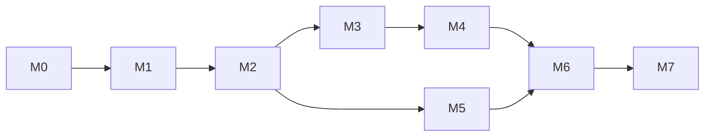

# Roadmap Dependencies

```mermaid
flowchart LR
  M0 --> M1
  M1 --> M2
  M2 --> M3
  M2 --> M5
  M3 --> M4
  M4 --> M6
  M5 --> M6
  M6 --> M7
```

Contracts、threat model 与 fake DSH 从 M0 开始持续演进。Browser/Terminal 不允许在 Runtime ownership 和 IPC security 未通过 M2 前直接接入 Agent。
